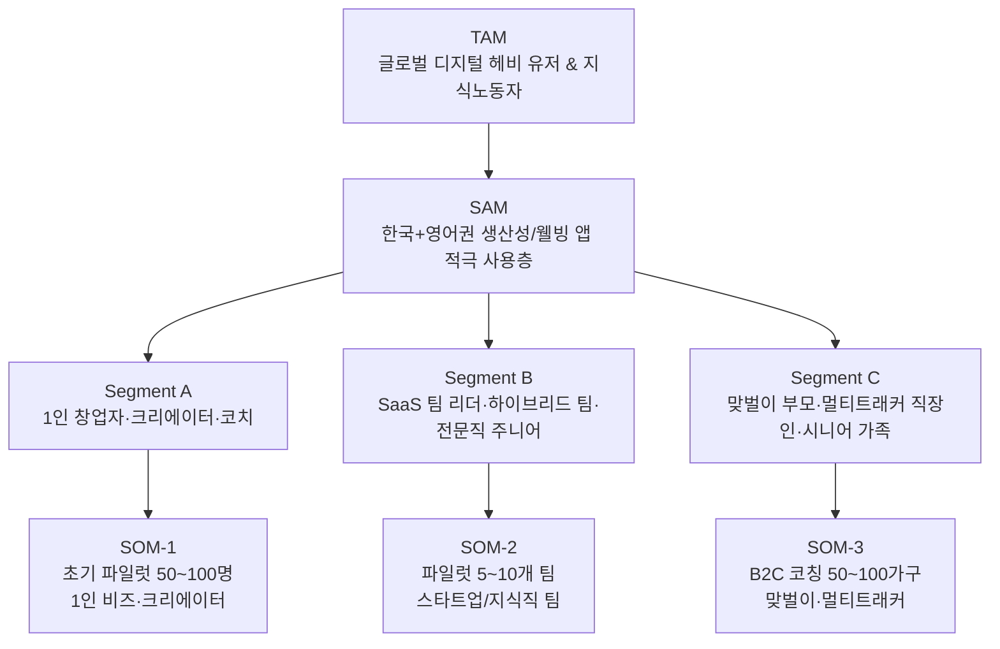

## 1. 디지털 미니멀리즘 비즈니스용 TAM–SAM–SOM + Segment Map

### 1) 정의 정리

- **TAM (Total Addressable Market)**
    
    전 세계적으로 **디지털 툴·앱 과부하와 디지털 피로를 느끼는 지식 노동자 & 헤비 디지털 유저 전체**
    
    (생산성/웰빙/습관 앱, SaaS 협업툴을 적극 사용하는 층 포함)
    
- **SAM (Serviceable Available Market)**
    
    그중에서
    
    - 한국어·영어 기반 온라인 서비스에 접근 가능
    - 자기계발·생산성·웰빙에 이미 돈을 써본 경험이 있는 20–40대
    - 원격/하이브리드 근무, 프리랜스, 1인 사업, 크리에이터, 지식직 등
        
        → **너가 온라인으로 실제 도달 가능한 고객군**
        
- **SOM (Serviceable Obtainable Market)**
    
    SAM 안에서 **초기 1–2년 안에 현실적으로 먹을 수 있는 비치헤드**:
    
    - **SOM-1:** 1인 창업자·크리에이터 50–100명
    - **SOM-2:** SaaS 스타트업 팀 리더/하이브리드 팀 5–10팀
    - **SOM-3:** 맞벌이 부모·멀티트래커 직장인 50–100명/가구

여기서, 네가 앞에 정의했던 20개 세그먼트를 **3개의 큰 Segment**로 묶어서 쓸게:

- **Segment A – 1인 비즈니스 & 크리에이터 계열**
    
    (1인 창업자/크리에이터, 스트리머, 코치/상담사 등)
    
- **Segment B – 조직 내 디지털 헤비 지식노동자 계열**
    
    (SaaS 스타트업 PM, 하이브리드 팀, 로펌·컨설팅 주니어, 연구자 등)
    
- **Segment C – 라이프·가정·다중역할 관리 계열**
    
    (맞벌이 부모, 멀티트래커 직장인, 시니어 스마트폰 관리 니즈 등)
    

---

### 2) TAM–SAM–SOM + Segment Map (Mermaid)

위 구조는 네가 올린 **Segment Map 예시**(TAM→SAM→Segment A/B/C→SOM) 구조를 그대로 가져와서, 디지털 미니멀리즘 버전으로 채운 거야. 
5_TAM-SAM-SOM_과_Market_Segment_…

---

## 2. 각 Segment별 고객 세분화 요약

### Segment A – 1인 창업자·크리에이터·코치

- **행동 특성**
    - 노션, 구글 워크스페이스, 이메일 마케팅 툴, 인스타/유튜브 등 **툴 스택이 이미 넓음**
    - 매출·콘텐츠·고객 관리가 **머리와 여러 앱에 분산**
- **핵심 Pain**
    - 세팅과 관리에 시간을 너무 많이 쓰고, **“진짜 중요한 일(콘텐츠·고객)”에 쓸 에너지가 모자람**
- **구매 트리거**
    - “툴/자동화가 내 시간을 돌려주면, 매출로 곧바로 회수 가능”이라는 직관이 있음
- **가격 민감도 & 채널**
    - 1:1 세션/코칭에 익숙, 월 몇 만원~십만 원대까지 수용 가능
    - 유튜브·인스타·브런치, 뉴스레터, 커뮤니티(슬랙/디스코드)에서 잘 잡힘

---

### Segment B – SaaS 스타트업 팀 리더·하이브리드 팀·전문직 주니어

- **행동 특성**
    - 슬랙/팀즈, 지라/아사나, 노션/컨플루언스, 메일, 캘린더 등 **협업툴 과부하**
    - 컨텍스트 스위칭이 심하고, “어디에 뭐가 있었는지” 계속 찾는 패턴
- **핵심 Pain**
    - 툴이 많을수록 팀이 **정렬(alignment)** 되지 않고, 실수·누락이 생긴다고 느낌
- **구매 트리거**
    - 팀 생산성/번아웃 문제가 KPI·성과와 직결될 때
    - “툴 콘솔리데이션과 워크플로우 리디자인”을 통해 팀 리더가 **영웅**이 될 수 있을 때
- **가격 민감도 & 채널**
    - B2B 예산으로 진행 가능 (팀당 프로젝트 수백~수천 단위도 가능)
    - 링크드인, 업계 커뮤니티, 스타트업 행사/콘퍼런스, 내부 추천/입소문

---

### Segment C – 맞벌이 부모·멀티트래커 직장인·시니어 가족

- **행동 특성**
    - 회사 툴 + 아이 학교앱 + 카카오톡 + 금융앱 + 가계부 + 일정/할 일 앱이 뒤섞여 있음
    - 머리로 “전체 일정/해야 할 일”을 어떻게든 들고 있으려다 계속 과부하
- **핵심 Pain**
    - **머릿속에 항상 켜져 있는 To-do 알람** 때문에 휴식이 안 됨
    - 가족/본인 건강·정신력이 서서히 갈리는 느낌
- **구매 트리거**
    - 건강 이상 신호, 육아·케어 부담 극대화, 재무/시간 계획이 한계에 부딪힐 때
- **가격 민감도 & 채널**
    - B2C라 상대적으로 예산이 작지만, “패키지·완성형”에는 기꺼이 지불
    - 맘카페, 라이프스타일/육아 블로그, 인스타 리일스, 카카오 채널 등

---

## 3. Persona Spectrum (Core / Adjacent / Extreme / Non-user)

이제 위 3개 Segment를 바탕으로, 네가 가진 **페르소나 스펙트럼 프레임**(핵심·확장·극단·비활성)에 맞춰 4명 페르소나를 뽑아볼게. 
6-1_페르소나와_페르소나_스펙트럼_고객_여정지도_작성_…

### 1) Mermaid로 보는 페르소나 스펙트럼

graph LR
  core["Core 민지(33) 1인 온라인 코치"]
  adjacent["Adjacent 성훈(38) SaaS 스타트업 PM"]
  extreme["Extreme 지우(29) ADHD 성향 지식노동자"]
  nonuser["Non-user 영자(52) 맞벌이 직장인·부모"]

  core --> adjacent
  core --> extreme
  adjacent --> nonuser

  
- **Core:** 서비스가 가장 먼저 설계되어야 하는 핵심 타깃
- **Adjacent:** 유사 니즈지만 다른 맥락 – 확장 시장
- **Extreme:** 실패/과부하 경험이 심해, 기능/UX 개선 인사이트를 많이 주는 사용자
- **Non-user:** 아직 이런 서비스를 쓰지 않거나, “필요 없다/귀찮다”고 느끼는 집단

---

### 2) 각 페르소나 상세 정의

### (1) Core Persona – 민지 (Segment A, SOM-1)

- **기본 정보**
    - 이름: 민지
    - 나이: 33세
    - 역할: 1인 온라인 코치 (워킹맘 대상 라이프/커리어 코칭)
    - 기술 수준: Notion·Zoom·메일마케팅 툴을 혼자 세팅해서 쓸 정도의 상위 20%
- **현재 행동·맥락**
    - 콘텐츠 기획은 Notion, 고객 관리와 결제는 엑셀+카카오톡, 일정은 구글 캘린더, 학습은 별도 플랫폼 등 **툴이 6~7개**
    - 매주 월요일마다 “이번 주 해야 할 일”을 다시 재구성하는 데만 2–3시간 소비
- **주요 Pain**
    - “툴이 많아질수록 시스템이 아니라 **내 머리**가 프로젝트 매니저가 되는 느낌”
    - 자동화 몇 개는 만들어봤지만, 서로 꼬여서 **신뢰하지 못하고** 결국 수동으로 재확인
- **목표 & 기대**
    - 코칭 매출을 늘리고 싶지만, **운영·정리에 쓰는 시간을 절반 이하로 줄이고 싶음**
    - “내 비즈니스가 하나의 OS처럼 정리된 느낌”을 원함
- **현재 대체 솔루션**
    - 유튜브에서 Notion 템플릿, 자동화 튜토리얼을 찾아 혼자 따라 함
    - 생산성·디지털 미니멀리즘 콘텐츠를 구독하지만 **실제 세팅은 항상 하다 말다**

---

### (2) Adjacent Persona – 성훈 (Segment B, SOM-2)

- **기본 정보**
    - 이름: 성훈
    - 나이: 38세
    - 역할: 시리즈 B 스타트업의 Product Manager (8명짜리 스쿼드 리더)
    - 기술 수준: 협업툴 파워유저, Notion/지라/슬랙 구조도 어느 정도 짤 줄 앎
- **현재 행동·맥락**
    - 회사에서 슬랙, 지라, 피그마, 노션, 구글 워크스페이스를 모두 사용
    - 팀원마다 사용하는 뷰·보드가 달라서, **동일 이슈를 서로 다른 툴에서 찾는 시간**이 많음
- **주요 Pain**
    - 회의 때마다 “어디에 적었지?”라는 말이 나오고,
        
        신규 입사자 온보딩에 툴 설명만 몇 주가 걸림
        
    - 본인도 어떤 툴을 줄여야 할지, 어떤 구조가 좋은지 **설계 기준이 없음**
- **목표 & 기대**
    - 팀이 한두 개의 코어 툴만 믿고 일하도록 만들고 싶음
    - “PM으로서 도구 설계와 자동화를 잘 한 사람”이라는 평판 확보
- **현재 대체 솔루션**
    - 본인이 노션에 팀용 위키/대시보드를 만들어봤지만, 유지보수 시간이 너무 많이 들어감
    - 외부 컨설턴트/코치보다는 **블로그·링크드인 글** 위주로 독학 중

---

### (3) Extreme Persona – 지우 (Segment A/B 걸쳐 있음)

- **기본 정보**
    - 이름: 지우
    - 나이: 29세
    - 역할: 프리랜서 디자이너 (ADHD 의심, 공식 진단은 없음)
    - 기술 수준: 툴 사용 자체는 빠르지만, **정착을 못 하고 계속 새 툴을 시도**하는 타입
- **현재 행동·맥락**
    - Todo 앱만 5개 이상 깔려 있고, 노션 워크스페이스도 여러 개
    - 항상 “이번엔 진짜 제대로 세팅해서 산다”고 마음먹지만, 2주쯤 지나면 또 새로운 것 탐색
- **주요 Pain**
    - 앱 세팅만 계속하다가 실제 작업 시간이 줄어드는 **메타 피로감**
    - 스스로를 “난 정리도 못 하는 사람”이라 생각하며 자기효능감이 떨어져 있음
- **목표 & 기대**
    - 툴을 줄이는 것도 중요하지만,
        
        **자기 패턴에 맞는 최소 구조**를 정의해주는 사람이 필요하다고 느낌
        
    - 자동화·노코드에 관심은 많지만, 복잡해 보이는 걸 보면 바로 회피
- **현재 대체 솔루션**
    - 트위터/레딧/커뮤니티에서 “세팅 인증” 글을 보며 나름 따라 하지만,
        
        결국 본인에게 맞지 않아 버리는 패턴 반복
        

---

### (4) Non-user Persona – 영자 (Segment C, 잠재 고객)

- **기본 정보**
    - 이름: 영자
    - 나이: 52세
    - 역할: 맞벌이 회사원 + 중학생 아이 엄마
    - 기술 수준: 카카오톡, 네이버, 은행/배달 앱 정도만 사용
- **현재 행동·맥락**
    - 아이 학교 공지, 가족 일정, 친정·시댁 일, 본인 회사 업무까지 **모두 카톡·머리·종이메모**에 섞여 있음
    - “핸드폰만 보면 피곤해”라고 느끼지만, 새로운 앱을 쓰는 건 더 피곤할 것 같아 회피
- **주요 Pain**
    - “내가 뭘 놓치고 있는 건 아닐까” 하는 불안
    - 동시에 “이 나이에 뭔 앱을 또 배우냐”는 거부감
- **목표 & 기대**
    - 남편·아이·부모님 일정과 집안일이 **한눈에 보이면** 좋겠다는 생각은 함
    - 단, “많이 눌러야 하는 서비스”는 싫고, **단순하고 쉽게 쓸 수 있는 것**만 원함
- **현재 대체 솔루션**
    - 종이 달력/벽에 붙인 메모 + 카톡 고정채팅
    - 가족 단톡방에서 잔소리와 리마인드로 버티는 중

영자는 현재는 **비활성(Non-user)**이지만,

“자녀가 대신 세팅해주는 서비스” 같은 B2C2C 형태로 접근하면, Segment C에서 중요한 확장 타깃이 될 수 있어.

---

## 4. Segment별 SOM 페르소나 정리 (한눈에 표)
| Segment | SOM 타깃 | 대표 페르소나 | 핵심 Pain | 너가 줄 수 있는 핵심 약속 |
| --- | --- | --- | --- | --- |
| **A – 1인 비즈/크리에이터** | SOM-1 (50–100명) | 민지 (33, 1인 온라인 코치) | 툴·자동화 세팅에 시간을 너무 많이 쓰고, 정작 코칭·콘텐츠에 집중 못함 | “당신 비즈니스의 디지털 환경을 3개 툴 안에서 자동으로 굴러가게 만들어, 주 5시간 이상을 돌려드립니다.” |
| **B – SaaS 팀 리더/지식직 팀** | SOM-2 (5–10개 팀) | 성훈 (38, PM) | 팀이 여러 협업툴에 흩어져 있어, 정보 누락·오버헤드가 큼 | “팀 전체 툴 스택을 2–3개로 통합하고, 표준 워크플로우와 대시보드를 설계해 ‘한 화면에서 일하게’ 만듭니다.” |
| **C – 맞벌이·멀티트래커·가정 운영자** | SOM-3 (50–100명/가구) | 영자 (52, 맞벌이+부모) | 가족/회사/집안 일이 머리에만 있어 항상 과부하 상태, 하지만 새 앱은 두려움 | “새 앱을 늘리지 않고, 지금 쓰는 최소한의 채널(카톡+캘린더)을 정리해서 ‘가족 운영판’을 만들어 드립니다. 세팅은 우리가 대신합니다.” |