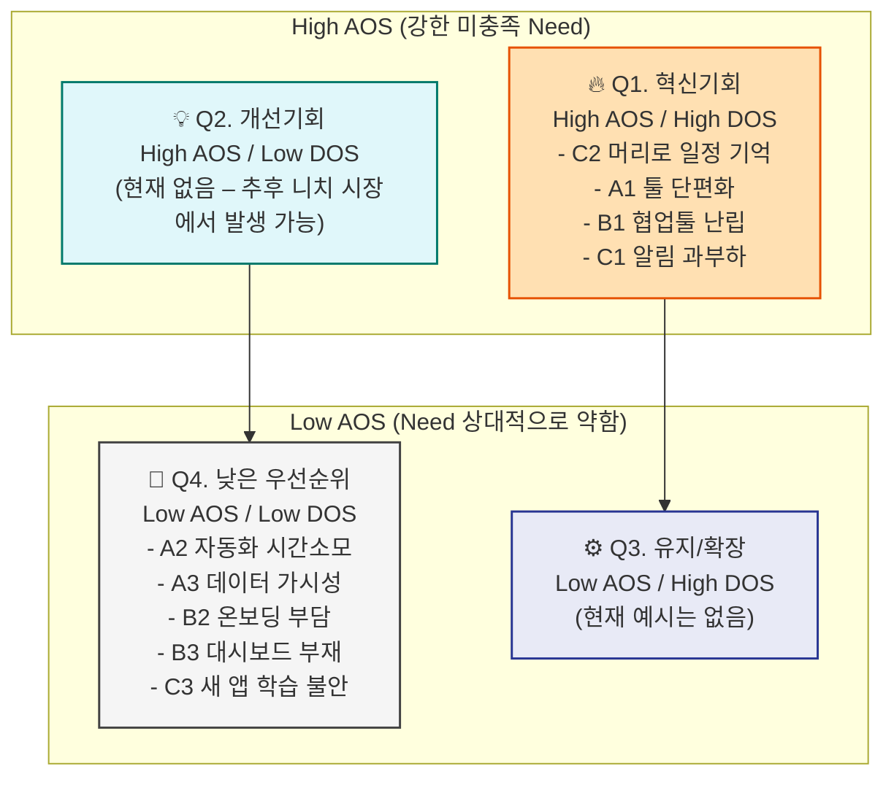

## 1. Pain별 Importance·Satisfaction·AOS·DOS (가설값)

### 공통 수식 리마인드 7_시장기회_분석을_위한_OS-AOS-DOS_계산_방법과…

- **AOS (Adjusted Opportunity Score)**
    
    `AOS = Importance × (1 − Satisfaction / 5)`
    
    → “중요한데 덜 해결된 문제”의 강도
    
- **DOS (Discovered Opportunity Score)**
    
    `DOS = (Importance − Satisfaction) × Market Relevance`
    
    → “고객 미충족 × 시장 파급력(TAM-SAM-SOM 기반)”
    

여기 숫자는 **인터뷰/설문 이전의 1차 가설**이라,

나중에 실제 인터뷰 응답을 받으면 그대로 다시 계산하면 돼.

---

### 1-1. 세 비즈니스 통합 Pain 리스트 (정렬: DOS↓ = 시장기회↓)

| ID | Segment / Persona | Pain (한 줄 정의) | Importance (1–5) | Satisfaction (1–5) | AOS | Market Relevance (0.1–1.0) | DOS | 해석(Quadrant) |
| --- | --- | --- | --- | --- | --- | --- | --- | --- |
| **C2** | C – 영자(맞벌이) | 머리로 일정·할 일 다 기억해서 항상 과부하 | **5** | **1** | **4.0** | 0.7 | **2.8** | **Q1 혁신기회** (Need·시장 모두 큼) |
| **A1** | A – 민지(1인코치) | 툴 단편화·중복 채널 때문에 정보가 흩어짐 | 5 | 2 | 3.0 | 0.9 | 2.7 | **Q1 혁신기회** |
| **B1** | B – 성훈(PM) | 협업툴 난립·컨텍스트 스위칭, 누락·재작업 | 5 | 2 | 3.0 | 0.9 | 2.7 | **Q1 혁신기회** |
| **C1** | C – 영자 | 가족/학교/업무 알림이 카톡·문자 등으로 과부하 | 5 | 2 | 3.0 | 0.8 | 2.4 | **Q1 혁신기회** |
| A2 | A – 민지 | 자동화·세팅에 과도한 시간 소모 | 4 | 2 | 2.4 | 0.8 | 1.6 | Q4 (필요는 있으나 상대적 우선순위↓) |
| B3 | B – 성훈 | 의사결정용 통합 대시보드 부재 | 4 | 2 | 2.4 | 0.8 | 1.6 | Q4 |
| A3 | A – 민지 | 매출·고객 데이터가 한눈에 안 보임 | 5 | 3 | 2.0 | 0.7 | 1.4 | Q4 |
| B2 | B – 성훈 | 신규 입사자 온보딩·툴 교육 부담 | 4 | 3 | 1.6 | 0.7 | 0.7 | Q4 |
| C3 | C – 영자 | 새 앱 학습/도입이 두렵고 귀찮음 | 3 | 2 | 1.8 | 0.6 | 0.6 | Q4 |
- AOS 평균 ≈ **2.58**, DOS 평균 ≈ **1.83** 기준으로
    
    **High/Low AOS, DOS**를 나눴고, Q1~Q4 라벨은 너 자료 그대로 사용.
    7_시장기회_분석을_위한_OS-AOS-DOS_계산_방법과…
    
- **초기 비즈니스 인사이트**:
    - 세 시장 모두에서 공통적으로 **“툴/정보 분산 → 머리가 계속 켜져 있는 상태”**가 상위 Pain.
    - 특히 **C2(머리로 일정 기억)**, **A1/B1(툴 단편화)**, **C1(알림 과부하)**가
        
        **“바로 사업으로 가져가도 되는 1순위 JTBD 후보”**로 보임.
        

---

## 2. AOS–DOS Combined Matrix (기회 크기 vs 실행 용이성)

여기서는

- **Y축 = AOS (고객 Need 강도 / 미충족 정도)**
- **X축 = DOS (시장 파급력·실행 용이성)**
    
    으로 두고, 네 PDF의 Combined Matrix 구조를 그대로 썼어.
    7_시장기회_분석을_위한_OS-AOS-DOS_계산_방법과…
    

**해석 포인트** (지금 단계 기준):

1. **최초 비치헤드**를 고를 때는
    
    Q1에 몰려 있는 **C2, A1, B1, C1** 4개 Pain 중심으로 실험 설계.
    
2. 나머지 Pain(A2, A3, B2, B3, C3)은
    - Q1 Pain에 대한 **부가 기능·옵션**으로 엮거나
    - 나중에 **라인 확장** 단계에서 다루면 됨.

---

## 3. JTBD 요약 카드 – 3개 비즈니스별 (페르소나 연결)

JTBD 카드는 네가 올려둔 포맷을 최대한 따라,

각 비즈니스당 **1장씩** 만들었어.
8-2_JTBD_인터뷰_결과_보고서_작성_방법

### 3-1. 비즈니스 A – 1인 비즈/크리에이터 OS (민지/지우)

**핵심 JTBD:**

> “여러 앱에 흩어진 비즈니스 운영을 최소 툴 세트로 정리해서,
> 
> 
> 세팅/관리 대신 **코칭·콘텐츠에 시간을 쓰고 싶다.**”
> 

**JTBD 요약 카드 – A**

- **Persona / Segment**
    - Core: **민지(33)** – 1인 온라인 코치 (Segment A, SOM-1)
    - Extreme: **지우(29)** – ADHD 성향 프리랜서 디자이너 (툴 탐색·갈아타기 과잉)
- **Situation (When …)**
    - 신규 프로그램/런칭 시즌마다 **노션·카톡·구글폼·스프레드시트**를 다시 세팅해야 하는 상황.
- **Job Statement (… I want to …)**
    - “내 코칭 비즈니스를 **3개 이하 툴**로 안정적으로 운영하고 싶다.”
- **Desired Outcome (… so I can …)**
    - 운영·세팅 시간 **주 5시간 → 1시간 이하**
    - 신규 프로그램 런칭 세팅 시간 **2일 → 반나절 이하**
    - 고객·매출 현황을 **한 화면에서 바로 확인**
- **4 Forces (Push / Pull / Habit / Anxiety)** 8-1_JTBD-interview-guide-card
    - **Push:** “툴이 많아질수록 정신이 더 산만해지고, 뭔가 계속 빠지는 느낌이다.”
    - **Pull:** “자동으로 고객 정보가 쌓이고, 결제·일정까지 연결되는 ‘비즈니스 OS’를 갖고 싶다.”
    - **Habit:** 카카오톡·엑셀·노션 조합에 이미 익숙해서, 완전 새로운 SaaS는 거부감.
    - **Anxiety:** 자동화가 꼬여서 **고객에게 누락/실수**가 나면 어쩌나 하는 불안.
- **Current Solutions / Workarounds**
    - 유튜브·블로그에서 Notion 템플릿·자동화 튜토리얼을 따라 함 (하지만 유지 실패).
    - 엑셀·카톡을 “마지막 안전장치”로 계속 유지.
- **Switch Triggers / Barriers**
    - **Trigger:** 고객 수가 20~30명 이상으로 늘면서, 수동 관리 한계 경험.
    - **Barrier:** 툴 마이그레이션 비용(데이터 이전, 학습)과 실패 경험.
- **Evidence (가상 인용)**
    - “런칭할 때마다 노션·폼 세팅을 새로 하는 느낌이에요.”
    - “자동화가 무서워서, 결국 마지막은 엑셀로 재확인해요.”
- **Priority (AOS / DOS)**
    - 대표 Pain: **A1 – 툴 단편화·중복 채널**
    - `AOS = 3.0`, `DOS = 2.7` → **Q1 혁신기회**
- **Notes (실험 아이디어)**
    - MVP:
        - 카톡/메일/폼/결제를 **노션(or 한 툴)**로 모아주는 1:1 셋업 패키지
        - “주 5시간 절감”을 측정하는 전/후 타임로그 실험
    - Extreme Persona(지우) 인터뷰에서 **‘툴 갈아타기 패턴’**을 더 깊게 캐면,
        
        온보딩·습관 설계 인사이트 나올 것.
        

---

### 3-2. 비즈니스 B – 팀 협업툴 통합 & 워크플로우 (성훈)

**핵심 JTBD:**

> “팀이 여러 협업툴에 휘둘리지 않고,
> 
> 
> **일관된 몇 개의 도구 안에서 정보와 커뮤니케이션을 관리해
> 실행 속도와 품질을 높이고 싶다.**”
> 

**JTBD 요약 카드 – B**

- **Persona / Segment**
    - Adjacent/Core: **성훈(38)** – SaaS 스타트업 PM, 8명 스쿼드 리더 (Segment B, SOM-2)
- **Situation (When …)**
    - 기능 출시 직전, QA·기획·디자인·개발 피드백이
        
        슬랙·지라·피그마·노션·메일에 **섞여 있는 상태**.
        
- **Job Statement**
    - “팀 의사결정과 실행 상태를 **한두 개 툴에서 한눈에 보고 관리**하고 싶다.”
- **Desired Outcome**
    - 주요 이슈 검색/파악 시간 **30분 → 5분**
    - 이슈 누락으로 인한 롤백/핫픽스 건수 **월 3건 → 0~1건**
    - 신규 입사자의 툴·프로세스 온보딩 기간 **4주 → 1~2주**
- **4 Forces** 8-1_JTBD-interview-guide-card
    - **Push:** “회의 때마다 ‘그거 어디에 있었지?’부터 시작하는 게 진짜 피곤하다.”
    - **Pull:** “하나의 ‘팀 OS’에서 이슈·문서·결정을 모두 링크하고 싶다.”
    - **Habit:** 각 직무가 자기 선호 툴(디자이너–피그마 코멘트, 개발–지라, 기획–노션)을 고집.
    - **Anxiety:** 툴 통합이 **조직 전체 프로젝트**가 되어버릴까 봐, 리더로서 리스크 부담.
- **Current Solutions**
    - PM이 개인적으로 노션에 “허브 페이지”를 만들어 링크를 수동 정리.
    - 카톡·슬랙·지라 알림을 개인 필터링/뮤트로 겨우 통제.
- **Switch Triggers / Barriers**
    - **Trigger:** 릴리즈 사고·버그로 인해 CEO/CPO가 “우리가 뭘 놓치고 있는 거냐”라고 질책.
    - **Barrier:** 기존 툴 라이선스·정책, 보안/권한, 팀원 반발.
- **Evidence (가상 인용)**
    - “문제는 툴이 아니라, 우리가 어디에 무엇을 남기기로 했는지가 없다는 거죠.”
    - “새 툴을 더 쓰자고 하면 팀원들이 질색해요.”
- **Priority (AOS / DOS)**
    - 대표 Pain: **B1 – 협업툴 난립·컨텍스트 스위칭**
    - `AOS = 3.0`, `DOS = 2.7` → **Q1 혁신기회**
- **Notes (실험 아이디어)**
    - MVP:
        - 현행 툴 스택 진단 → 2~3개 코어 툴로 **룰·템플릿·통합** 재설계
        - 4주 파일럿 팀 운영 후, **컨텍스트 스위칭 횟수·탐색시간·버그건수** 전/후 비교.
    - 장기적으로는 **“팀 OS 설계 패키지”**를 표준화해 B2B 상품화 가능.

---

### 3-3. 비즈니스 C – 라이프 운영판 (맞벌이 가정, 영자)

**핵심 JTBD:**

> “가족·일·집안일 일정을
> 
> 
> 머릿속에서가 아니라 **한 화면에서 관리**해서,
> 
> 항상 켜져 있는 걱정을 줄이고 편안하게 살고 싶다.”
> 

**JTBD 요약 카드 – C**

- **Persona / Segment**
    - Core: **영자(52)** – 맞벌이 회사원 + 중학생 자녀 엄마 (Segment C, SOM-3)
- **Situation (When …)**
    - 아이 시험·행사, 본인 회의, 시댁·친정 일정이 **같은 주에 몰렸을 때**,
        
        카톡·알림장·캘린더·구두 약속이 뒤섞인 상태.
        
- **Job Statement**
    - “우리 가족의 일정과 중요한 할 일을 **한눈에 보고 빠짐없이 챙기고 싶다.”
- **Desired Outcome**
    - 잊어버려서 생기는 **‘깜빡 실수’ 월 2~3회 → 0~1회**
    - 스케줄 재정리/확인에 쓰는 시간 **하루 20~30분 → 5분 이내**
    - ‘항상 뭔가 놓치는 것 같다’는 주관적 불안감 감소.
- **4 Forces** 8-1_JTBD-interview-guide-card
    - **Push:** “카톡방이 너무 많아서 중요한 걸 자꾸 놓치는 것 같다.”
    - **Pull:** “핸드폰에서 간단히 볼 수 있는 **가족용 하나의 보드**가 있으면 좋겠다.”
    - **Habit:** 종이 달력 + 가족 단톡방 조합에 익숙, 새로운 앱은 귀찮고 무섭다.
    - **Anxiety:** “내가 이런 IT 서비스를 제대로 쓸 수 있을까?” 하는 학습 불안.
- **Current Solutions**
    - 벽 달력, 냉장고 메모, 가족 단톡방, 본인 회사 캘린더를 머리로 통합.
    - 중요한 건 본인이 반복해서 카톡/전화로 리마인드.
- **Switch Triggers / Barriers**
    - **Trigger:** 아이 시험/행사나 병원 예약을 정말 크게 한 번 놓쳤을 때.
    - **Barrier:** “새 앱 설치”에 대한 거부감, 남편·아이의 협조 여부.
- **Evidence (가상 인용)**
    - “핸드폰만 보면 일이 생각나서, 쉬는 느낌이 안 나요.”
    - “새로 배우는 건 귀찮고, 누가 대신 세팅만 해주면 좋겠어요.”
- **Priority (AOS / DOS)**
    - 대표 Pain:
        - **C2 – 머리로 일정/To-do 기억** → `AOS = 4.0`, `DOS = 2.8` (전체 1위)
        - **C1 – 알림 과부하** → `AOS = 3.0`, `DOS = 2.4`
    - 둘 다 **Q1 혁신기회**
- **Notes (실험 아이디어)**
    - MVP:
        - “**부모님 라이프 운영판 세팅 서비스**” – 카톡/캘린더 기반, 앱 추가 설치 최소화.
        - 자녀(혹은 자녀 세대)를 **B2C2C 파트너**로 삼아, 대신 세팅 + 간단 사용 교육 패키지.
    - 인터뷰 시 **ADHD·경계선 피로**가 있는 맞벌이 층을 별도 Extreme Persona로 설정하면 인사이트 풍부.

---

## 4. 이 숫자를 실제로 “검증”하는 다음 단계

지금까지는 **너가 가진 리서치 + 내 추론을 합친 1차 가설**이야.

네 템플릿에 맞춰 실제 검증을 하려면:

1. **페르소나별 Pain 리스트 확정**
    - 위 표의 A1~C3를 기반으로, 각 페르소나당 3–5개 Pain만 선정.7_시장기회_분석을_위한_OS-AOS-DOS_계산_방법과…
2. **인터뷰 & 설문으로 Importance / Satisfaction 수집**
    - 각 Pain에 대해 1–5점 리커트로
        - “이 Pain이 당신에게 얼마나 중요한가?”
        - “지금 이 문제가 얼마나 잘 해결되고 있다고 느끼는가?” 를 묻기.8-1_JTBD-interview-guide-card
3. **AOS 재계산 → 우선순위 재정렬**
    - 스프레드시트/노션 테이블에 `AOS = I × (1 − S/5)` 수식 적용.7_시장기회_분석을_위한_OS-AOS-DOS_계산_방법과…
4. **TAM-SAM-SOM 리서치 기반 Market Relevance 추정 → DOS 계산**
    - 각 Pain이 전체 시장(또는 세그먼트)에서 차지하는 비중·파급력(0.1~1.0)을 입력해 `DOS` 계산.7_시장기회_분석을_위한_OS-AOS-DOS_계산_방법과…
5. **AOS-DOS Combined Matrix 업데이트**
    - 오늘 만든 Mermaid 구조 그대로 쓰되, 값만 업데이트해서
        
        Q1에 남는 Pain이 진짜 비즈니스 기회.