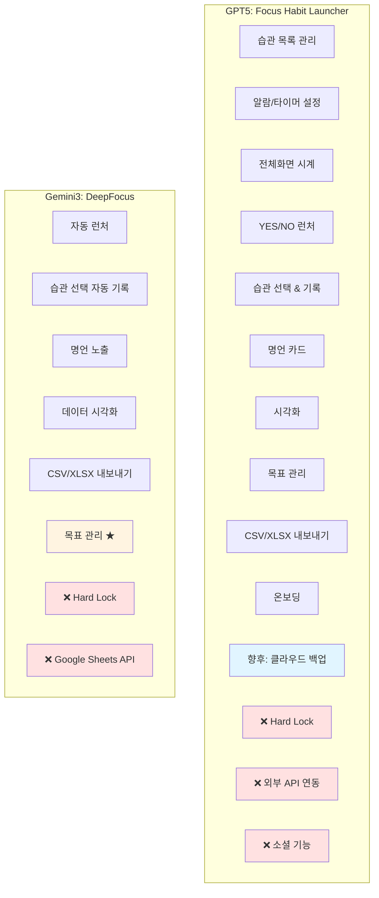
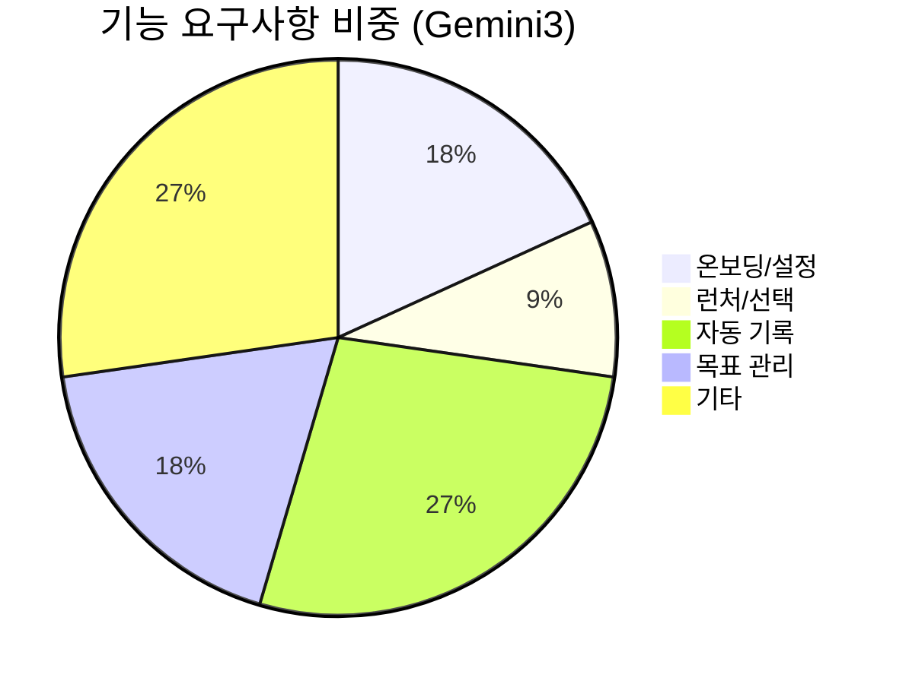
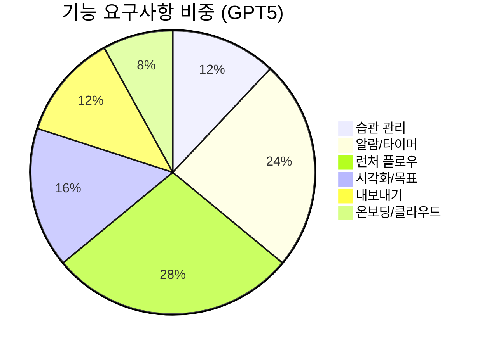
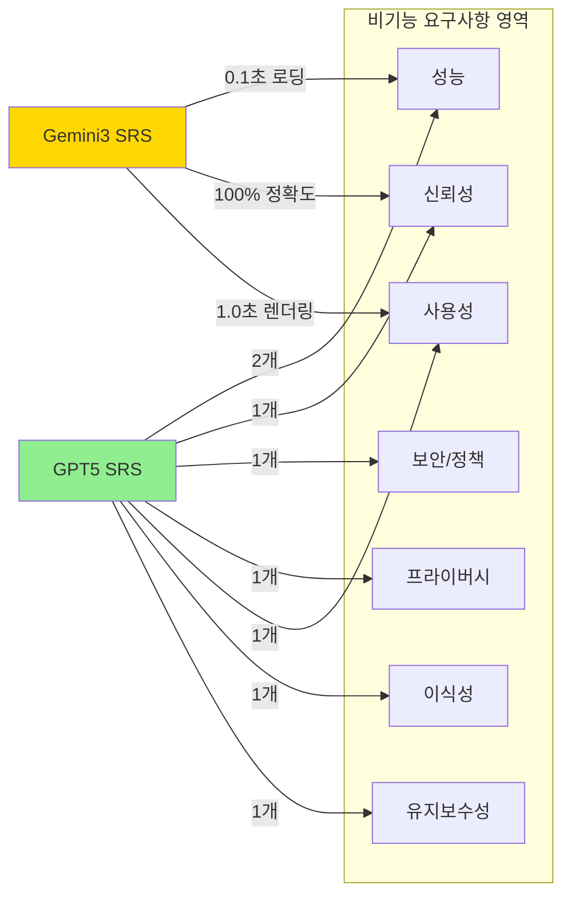
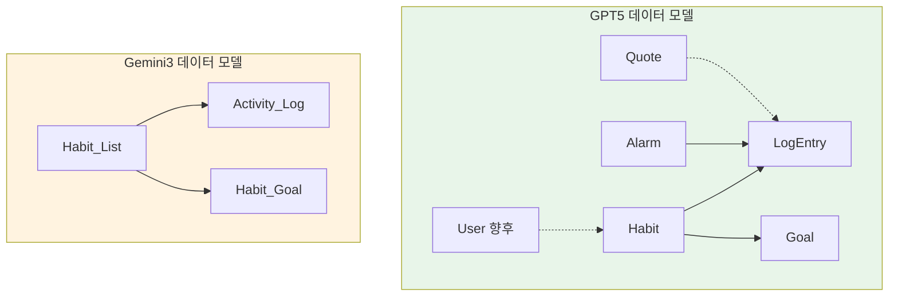
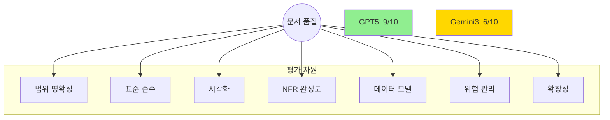
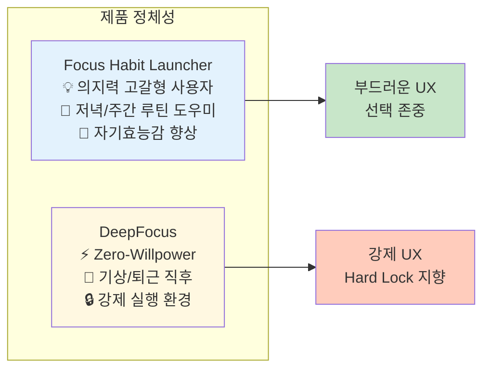

## **SRS 문서 비교 분석표**

| 비교 항목 | GPT5 버전 | Gemini3 버전 | 차이점 평가 |
| --- | --- | --- | --- |
| **문서 ID/프로젝트명** | Focus Habit Launcher 버전 1.1 (MVP 정리본) | DeepFocus SRS-DeepFocus-006 버전 1.6 | 프로젝트 네이밍이 완전히 다름 |
| **문서 분량** | 617줄 (상세함) | 872줄 (매우 상세함 + 중복 포함) | Gemini 버전이 더 길지만 GPT5 내용 중복 포함 |
| **포함 범위 기술** | 매우 구체적 (9개 상세 항목) - 알람/타이머 설정 - 전체화면 시계 - YES/NO 플로우 - 목표 관리 - CSV/XLSX 내보내기 | 간결한 요약 (3개 카테고리) - 핵심 기능 - 데이터 관리 - 목표 관리 | GPT5가 더 실용적이고 구체적 |
| **제외 범위** | 명확히 정의: - Hard Lock 금지 - 외부 API 연동 제외 - 소셜 기능 제외 | Hard Lock과 Google Sheets API만 언급 | GPT5가 더 명확한 경계 설정 |
| **Hard Lock 처리** | ★ 명시적 제외 + 비기능 요구사항(REQ-NF-004)에서 금지 정책 명시 | Out-of-Scope로 간단히 제외만 언급 | GPT5가 정책 위험을 더 강하게 차단 |
| **클라우드 백업/계정** | v1.0 MVP에서 구현 안 함 v2+ 로드맵으로 명확히 구분 | 언급 없음 (Out-of-Scope에 포함된 것으로 추정) | GPT5가 향후 확장성 명시 |
| **용어 정의** | 7개 용어 (습관, 알람 세션, 자기기록, 런처 화면, 스트릭, FR, NFR) | 3개 용어 (Habit Goal, Goal Progress, Export Format) - 목표 관련에만 집중 | GPT5가 전체 시스템 용어를 포괄 |
| **이해관계자** | 5개 역할 명시 (PO, 디자이너, 개발자, QA, 데이터 담당) | 3개 역할 (End User, Designer/PM, Developer) | GPT5가 조직 구조를 더 반영 |
| **시스템 컨텍스트** | Mermaid 다이어그램 1개 (명확한 구조) | Mermaid 없음 (텍스트로만 설명) | GPT5가 시각화 우수 |
| **시퀀스 다이어그램** | 없음 | 1개 (목표 설정 & 추적 시퀀스) | Gemini가 특정 기능에 대해 상세 |
| **사용자 플로우** | Mermaid Flowchart 제공 (알람→YES/NO→습관 선택) | 없음 | GPT5가 사용자 여정 시각화 우수 |
| **상태 다이어그램** | 없음 | Mermaid 제공 (IDLE→QUESTION→SELECTION→TIMER→RESULT) | Gemini가 상태 전이 상세 |
| **기능 요구사항 수** | 24개 (REQ-FUNC-001 ~ 024) | 11개 주요 항목 (REQ-FUNC-001, 004~007, 010~018 등) | GPT5가 더 포괄적 |
| **비기능 요구사항** | 8개 (성능 2, 신뢰성 1, 보안/정책 1, 프라이버시 1, 사용성 1, 이식성 1, 유지보수성 1) | 3개 (Usability 2, Data Integrity 1) + 일부 원본에서 참조 | GPT5가 NFR 영역 완성도 높음 |
| **성능 기준** | - 런처 화면: 1초 이내 - 기록 저장: 0.5초 이내 - 99.5% 데이터 무손실 | - 습관 목록 로딩: 0.1초 - 목표 시각화: 1.0초 - 100% 데이터 정확도 | Gemini가 일부 더 엄격, GPT5가 전반적 기준 명확 |
| **데이터 모델** | 5개 엔터티 상세 정의 (User, Habit, Alarm, LogEntry, Goal, Quote) + Mermaid 관계도 | 3개 테이블만 정의 (Habit_List, Activity_Log, Habit_Goal) | GPT5가 전체 데이터 아키텍처 제시 |
| **API 명세** | 부록에 향후 서버 API 예시 4개 제시 | 없음 | GPT5가 확장성 고려 |
| **추적성 매트릭스** | 없음 | 있음 (User Story ↔ FR ↔ Test Case 매핑) | Gemini가 테스트 연결성 우수 |
| **문서 구조 완결성** | ISO 29148 표준 완벽 준수 (1~6장 체계 완성) | 표준 준수하나 일부 섹션 간략 (특히 시스템 인터페이스 부분) | GPT5가 표준 준수도 높음 |
| **★ 표시 (최신 수정)** | 17개 항목에 ★ 표시 (최근 논의 반영) | 8개 항목에 ★ 표시 (목표 기능 추가에 집중) | GPT5가 더 많은 개선 반영 |
| **내용 중복** | 없음 (깔끔한 단일 버전) | 206줄부터 GPT5 내용 전체 복사됨 (중복) | Gemini 파일에 심각한 편집 오류 |

---

## **핵심 차이점 요약**

### **1. 범위 정의 명확성**

- **GPT5**: 매우 구체적, 제외 사항 명확, MVP vs 향후 버전 구분 철저
- **Gemini**: 간결하지만 모호한 부분 존재

### **2. 위험 관리**

- **GPT5**: Hard Lock을 제외 범위 + 비기능 요구사항 둘 다에서 금지 → 앱스토어 리젝 위험 사전 차단
- **Gemini**: 간단히 제외만 언급

### **3. 시각화**

- **GPT5**: 시스템 컨텍스트 + 사용자 플로우 + 데이터 관계도 (Mermaid 3개)
- **Gemini**: 시퀀스 다이어그램 + 상태 다이어그램 (Mermaid 2개, 단 1개는 문법 오류)

### **4. 완성도**

- **GPT5**: MVP 개발에 즉시 사용 가능한 수준, 표준 완벽 준수
- **Gemini**: 일부 기능(목표 관리)에 집중, 중복 내용으로 인한 혼란

---

## **비교 시각화 (Mermaid)**

**1. 문서 범위 비교**

**2. 요구사항 분포 비교**

**3. 비기능 요구사항 커버리지**

**4. 데이터 모델 복잡도**

**5. 문서 완성도 레이더 차트 (개념적 표현)**

**6. 프로젝트 정체성 차이**

---

## **권장 사항**

**MVP 개발용으로는 GPT5 버전 선택 추천**

**이유:**

1. ✅ 범위가 명확하고 MVP/향후 버전 구분이 철저
2. ✅ Hard Lock 금지가 비기능 요구사항에 명시되어 앱스토어 리스크 최소화
3. ✅ ISO 29148 표준 완벽 준수로 개발팀 커뮤니케이션 용이
4. ✅ 데이터 모델과 API 설계 가이드 포함으로 아키텍처 설계 지원
5. ✅ 중복 내용 없이 깔끔한 단일 버전

**Gemini3 버전의 활용:**

- 목표 설정 기능의 시퀀스 다이어그램은 GPT5 문서에 통합 고려
- 추적성 매트릭스(User Story ↔ FR ↔ TC)는 QA 계획 수립 시 참고
- 상태 다이어그램은 개발팀 기술 설계 시 활용