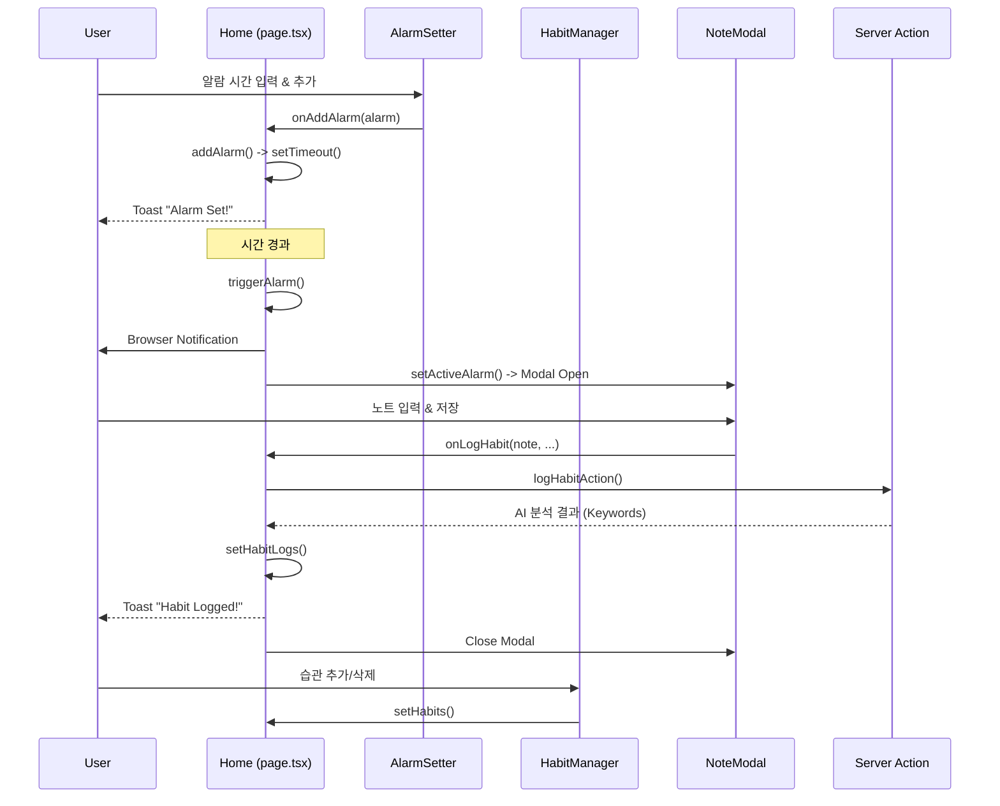

# 함수 호출 계층 구조 (Function Call Hierarchy)

이 문서는 `page.tsx`를 중심으로 한 애플리케이션의 주요 함수 호출 및 데이터 흐름을 시각화합니다. 트러블슈팅 및 로직 분석 시 참고하시기 바랍니다.

## 1. 메인 컨트롤러 (Home Component)

`src/app/page.tsx`는 애플리케이션의 진입점이자 상태 관리의 중심입니다.

### 🔄 초기화 및 라이프사이클
*   **`useEffect` (Mount)**
    *   `localStorage.getItem` ('focus-habit-logs') → `setHabitLogs`
    *   `localStorage.getItem` ('focus-habit-habits') → `setHabits`
    *   `localStorage.getItem` ('focus-habit-alarms') → `addAlarm` (재등록)
    *   `Notification.requestPermission`

*   **`useEffect` (Data Persistence)**
    *   `habitLogs` 변경 → `localStorage.setItem`
    *   `habits` 변경 → `localStorage.setItem`
    *   `alarms` 변경 → `localStorage.setItem`

### ⏰ 알람 관리 로직
*   **`addAlarm(alarm, showToast)`**
    *   Validation: 중복 체크
    *   Scheduling: `setTimeout` 설정
    *   State Update: `setAlarms`
    *   Callback: 타이머 만료 시 `triggerAlarm` 호출

*   **`triggerAlarm(alarm)`**
    *   State Update: `setActiveAlarm` (모달 오픈)
    *   State Update: `setAlarms` (일회성 알람 제거)
    *   Browser API: `new Notification()`
    *   Feedback: `toast()`

*   **`deleteAlarm(alarmId)`**
    *   Cleanup: `clearTimeout`
    *   State Update: `setAlarms`

### 📝 습관 기록 로직
*   **`handleLogHabit(note, startTime, habit)`**
    *   Async Call: `logHabitAction` (Server Action)
    *   State Update: `setHabitLogs`
    *   Cleanup: `setActiveAlarm(null)` (모달 닫기)
    *   Feedback: `toast()`

---

## 2. 컴포넌트 간 호출 흐름 (Mermaid)

## 3. 파일별 주요 함수 매핑

### `src/components/note-modal.tsx`
*   **`handleSubmit`**: 폼 제출 처리, `onLogHabit` 호출 트리거
*   **`isHabitCompletedToday`**: 오늘의 습관 완료 여부 확인 (UI 상태 제어)
*   **`habitStats` (useMemo)**: `habitLogs` 데이터를 기반으로 차트용 데이터 가공 (Today, Week, Month 집계)

### `src/components/alarm-setter.tsx`
*   **`handleSubmit`**: 시간/라벨 입력 검증 후 `onAddAlarm` 호출

### `src/app/actions.ts`
*   **`logHabitAction`**: Genkit(AI)을 사용하여 노트 내용에서 키워드 추출 및 로그 객체 생성

## 4. 트러블슈팅 가이드
*   **알람이 울리지 않음**: `timeoutIdsRef`가 `deleteAlarm`이나 페이지 리로드 시 올바르게 관리되는지, `useEffect`의 재등록 로직(`addAlarm(..., false)`)을 확인하세요.
*   **AI 키워드 추출 실패**: `logHabitAction`의 에러 로그를 확인하고, `handleLogHabit`의 try-catch 블록을 점검하세요.
*   **데이터 저장 안됨**: `useEffect` 내의 `localStorage.setItem` 로직과 브라우저의 스토리지 할당량을 확인하세요.

