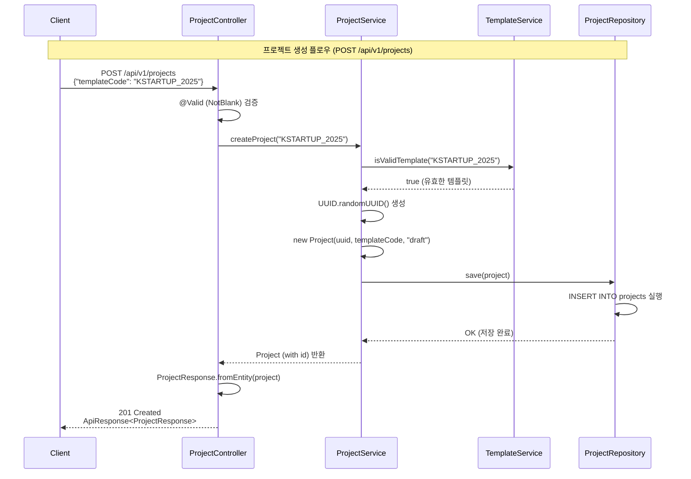
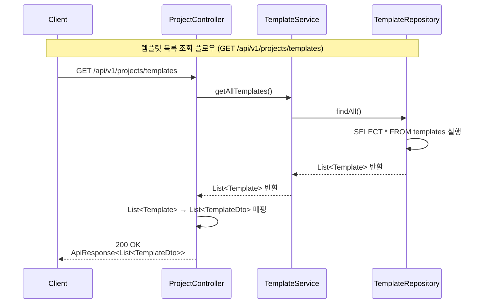

# API 설계 다이어그램 (API Design Diagrams)

> **목적:** API 요청부터 응답까지의 데이터 흐름을 시각화하여 개발자들이 API 동작을 쉽게 이해할 수 있도록 합니다.

---

## 📋 목차

1. [프로젝트 생성 API](#프로젝트-생성-api)
2. [템플릿 목록 조회 API](#템플릿-목록-조회-api)

---

## 프로젝트 생성 API

### 엔드포인트
- **Method:** `POST`
- **Path:** `/api/v1/projects`
- **Description:** 템플릿 코드를 기반으로 새 프로젝트를 생성합니다.

### 데이터 흐름 다이어그램

### 주요 단계 설명

1. **요청 검증**: `@Valid` 어노테이션으로 `templateCode`가 비어있지 않은지 검증
2. **템플릿 유효성 확인**: `TemplateService`를 통해 템플릿 코드가 유효한지 확인
3. **프로젝트 생성**: UUID 생성 후 `draft` 상태로 프로젝트 엔티티 생성
4. **데이터 저장**: `ProjectRepository`를 통해 데이터베이스에 저장
5. **응답 변환**: 엔티티를 `ProjectResponse` DTO로 변환하여 반환

---

## 템플릿 목록 조회 API

### 엔드포인트
- **Method:** `GET`
- **Path:** `/api/v1/projects/templates`
- **Description:** 사용 가능한 모든 프로젝트 템플릿 목록을 조회합니다.

### 데이터 흐름 다이어그램

### 주요 단계 설명

1. **템플릿 조회**: `TemplateService`를 통해 모든 템플릿 조회
2. **데이터베이스 조회**: `TemplateRepository`에서 템플릿 목록 조회
3. **DTO 변환**: 엔티티 리스트를 `TemplateDto` 리스트로 변환
4. **응답 반환**: 변환된 DTO 리스트를 클라이언트에 반환

---

## 📝 참고사항

- 모든 API는 `/api/v1/` 경로로 시작합니다
- 요청 검증은 `@Valid` 또는 `@Validated` 어노테이션을 사용합니다
- 엔티티는 직접 반환하지 않고 DTO로 변환하여 반환합니다
- 에러 처리는 `@ControllerAdvice`를 통해 전역적으로 처리됩니다

---

## 🔗 관련 문서

- [REST API 설계 규칙](../.cursor/rules/401-rest-api-design-rules.mdc)
- [Spring Boot 개발 가이드](../.cursor/rules/400-spring-boot-rules.mdc)
- [예외 처리 규칙](../.cursor/rules/403-exception-handling-rules.mdc)

---

**마지막 업데이트:** 2026-01-15

