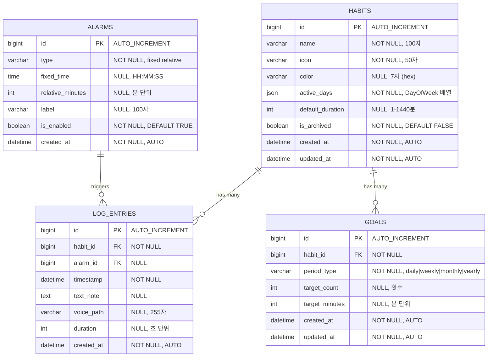
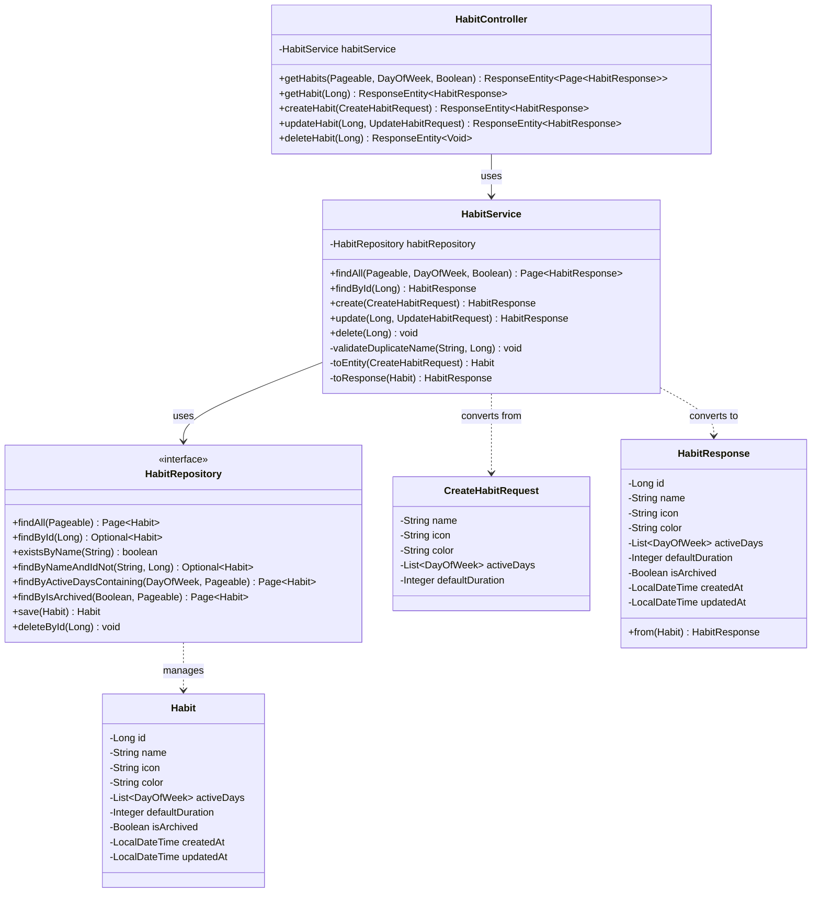

# 데이터 아키텍처 설계 (ERD, CLD, ORM)

> **목적:** 데이터베이스 설계부터 백엔드 구현까지의 전체 데이터 아키텍처를 ERD, CLD, ORM 예제코드로 시각화하여 개발자들이 데이터 흐름을 명확히 이해할 수 있도록 합니다.

---

## 📋 목차

1. [ERD (Entity Relationship Diagram)](#1-erd-entity-relationship-diagram)
2. [CLD (Class/Component Logic Diagram)](#2-cld-classcomponent-logic-diagram)
3. [ORM 예제코드 (Object Relational Mapping)](#3-orm-예제코드-object-relational-mapping)

---

## 1. ERD (Entity Relationship Diagram)

**데이터베이스 관점: 데이터가 어떻게 저장될 것인가?**

### 전체 ERD 다이어그램



### 테이블 구조 상세

#### `habits` 테이블

| 컬럼명 | 타입 | 제약조건 | 설명 |
|--------|------|----------|------|
| `id` | BIGINT | PRIMARY KEY, AUTO_INCREMENT | 습관 고유 식별자 |
| `name` | VARCHAR(100) | NOT NULL, UNIQUE | 습관 이름 (중복 불가) |
| `icon` | VARCHAR(50) | NOT NULL | 아이콘 (이모지 또는 아이콘 코드) |
| `color` | VARCHAR(7) | NULL, DEFAULT '#4A90E2' | Hex 색상 코드 (#RRGGBB) |
| `active_days` | JSON | NOT NULL | 활성 요일 배열 (예: ["MONDAY", "WEDNESDAY"]) |
| `default_duration` | INT | NULL, DEFAULT 30 | 기본 지속 시간 (분 단위, 1-1440) |
| `is_archived` | BOOLEAN | NOT NULL, DEFAULT FALSE | 아카이브 여부 (Soft Delete) |
| `created_at` | DATETIME | NOT NULL | 생성 일시 |
| `updated_at` | DATETIME | NOT NULL | 수정 일시 |

**인덱스:**
- `PRIMARY KEY (id)`
- `UNIQUE KEY uk_habits_name (name)`
- `INDEX idx_habits_active_days (active_days)` - 요일 필터링 최적화
- `INDEX idx_habits_archived (is_archived)` - 아카이브 필터링 최적화

**관계:**
- `HABITS` 1:N `LOG_ENTRIES` (하나의 습관은 여러 로그 엔트리를 가짐)
- `HABITS` 1:N `GOALS` (하나의 습관은 여러 목표를 가짐)

#### `log_entries` 테이블

| 컬럼명 | 타입 | 제약조건 | 설명 |
|--------|------|----------|------|
| `id` | BIGINT | PRIMARY KEY, AUTO_INCREMENT | 로그 고유 식별자 |
| `habit_id` | BIGINT | NOT NULL, FK → habits.id | 습관 ID |
| `alarm_id` | BIGINT | NULL, FK → alarms.id | 알람 ID (선택적) |
| `timestamp` | DATETIME | NOT NULL | 기록 일시 |
| `text_note` | TEXT | NULL | 텍스트 메모 |
| `voice_path` | VARCHAR(255) | NULL | 음성 파일 경로 |
| `duration` | INT | NULL | 수행 시간 (초 단위) |
| `created_at` | DATETIME | NOT NULL | 생성 일시 |

**인덱스:**
- `PRIMARY KEY (id)`
- `INDEX idx_log_entries_habit_id (habit_id)` - 습관별 조회 최적화
- `INDEX idx_log_entries_timestamp (timestamp)` - 시간 범위 조회 최적화

---

## 2. CLD (Class/Component Logic Diagram)

**백엔드 서버 관점: 데이터가 어떻게 가공될 것인가?**

### 클래스 다이어그램



### 3-Tier 아키텍처 흐름

```
┌─────────────────────────────────────────────────────────────┐
│                    Controller Layer                          │
│  ┌──────────────────────────────────────────────────────┐   │
│  │ HabitController                                      │   │
│  │  - HTTP 요청/응답 처리                               │   │
│  │  - DTO 검증 (@Valid)                                 │   │
│  │  - HTTP 상태 코드 관리                               │   │
│  └──────────────────────────────────────────────────────┘   │
└───────────────────────────┬─────────────────────────────────┘
                            │
                            ▼
┌─────────────────────────────────────────────────────────────┐
│                     Service Layer                            │
│  ┌──────────────────────────────────────────────────────┐   │
│  │ HabitService                                          │   │
│  │  - 비즈니스 로직 처리                                 │   │
│  │  - 트랜잭션 관리 (@Transactional)                     │   │
│  │  - 예외 처리 (HabitNotFoundException 등)              │   │
│  │  - DTO ↔ Entity 변환                                  │   │
│  └──────────────────────────────────────────────────────┘   │
└───────────────────────────┬─────────────────────────────────┘
                            │
                            ▼
┌─────────────────────────────────────────────────────────────┐
│                   Repository Layer                          │
│  ┌──────────────────────────────────────────────────────┐   │
│  │ HabitRepository                                       │   │
│  │  - 데이터 접근 (JPA)                                  │   │
│  │  - 쿼리 메서드 (Query Methods)                        │   │
│  │  - 커스텀 쿼리 (@Query)                               │   │
│  └──────────────────────────────────────────────────────┘   │
└───────────────────────────┬─────────────────────────────────┘
                            │
                            ▼
┌─────────────────────────────────────────────────────────────┐
│                    Database (MySQL)                          │
│  ┌──────────────────────────────────────────────────────┐   │
│  │ habits 테이블                                         │   │
│  │  - 데이터 영구 저장                                   │   │
│  │  - 인덱스 최적화                                      │   │
│  └──────────────────────────────────────────────────────┘   │
└─────────────────────────────────────────────────────────────┘
```

### 데이터 흐름 (습관 생성 예시)

1. **Controller**: `POST /api/v1/habits` 요청 수신
   - `CreateHabitRequest` DTO 검증 (`@Valid`)
   - 실패 시: `400 Bad Request` 반환

2. **Service**: 비즈니스 로직 처리
   - 중복 이름 체크 (`existsByName()`)
   - 실패 시: `HabitAlreadyExistsException` → `409 Conflict`
   - DTO → Entity 변환
   - 기본값 설정 (color, defaultDuration)

3. **Repository**: 데이터 저장
   - `save(habit)` 호출
   - JPA가 SQL INSERT 생성 및 실행
   - 트랜잭션 커밋

4. **Service**: 응답 생성
   - Entity → Response DTO 변환
   - `HabitResponse` 반환

5. **Controller**: HTTP 응답
   - `201 Created` + `Location` 헤더
   - `HabitResponse` 본문 반환

---

## 3. ORM 예제코드 (Object Relational Mapping)

**서버가 데이터베이스를 조회하는 연결적 관점: 실제 구현 코드**

### 3.1 JPA Entity (데이터베이스 테이블 매핑)

```java
package vibe.selfdevleop.selfdevleop_backend_prepare.entity;

import jakarta.persistence.*;
import lombok.*;
import org.springframework.data.annotation.CreatedDate;
import org.springframework.data.annotation.LastModifiedDate;
import org.springframework.data.jpa.domain.support.AuditingEntityListener;

import java.time.DayOfWeek;
import java.time.LocalDateTime;
import java.util.ArrayList;
import java.util.List;

/**
 * 습관 엔티티
 * 
 * @Entity: JPA 엔티티로 인식
 * @Table: 데이터베이스 테이블명 지정
 * @EntityListeners: Auditing 기능 활성화 (createdAt, updatedAt 자동 설정)
 */
@Entity
@Table(name = "habits", indexes = {
    @Index(name = "idx_habits_active_days", columnList = "active_days"),
    @Index(name = "idx_habits_archived", columnList = "is_archived")
})
@EntityListeners(AuditingEntityListener.class)
@Getter
@Setter
@NoArgsConstructor(access = AccessLevel.PROTECTED)
@AllArgsConstructor
@Builder
public class Habit {
    
    /**
     * 습관 고유 식별자
     * @Id: Primary Key 지정
     * @GeneratedValue: 자동 증가 전략 (IDENTITY = AUTO_INCREMENT)
     */
    @Id
    @GeneratedValue(strategy = GenerationType.IDENTITY)
    @Column(name = "id")
    private Long id;
    
    /**
     * 습관 이름 (중복 불가)
     * @Column: 컬럼 제약조건 설정
     */
    @Column(name = "name", nullable = false, length = 100, unique = true)
    private String name;
    
    /**
     * 아이콘 (이모지 또는 아이콘 코드)
     */
    @Column(name = "icon", nullable = false, length = 50)
    private String icon;
    
    /**
     * Hex 색상 코드 (#RRGGBB)
     * 기본값: #4A90E2
     */
    @Column(name = "color", length = 7)
    @Builder.Default
    private String color = "#4A90E2";
    
    /**
     * 활성 요일 목록
     * @ElementCollection: 컬렉션 타입 매핑
     * @Enumerated: Enum을 문자열로 저장
     * @CollectionTable: 컬렉션 테이블 설정
     */
    @ElementCollection(targetClass = DayOfWeek.class, fetch = FetchType.EAGER)
    @Enumerated(EnumType.STRING)
    @CollectionTable(name = "habit_active_days", joinColumns = @JoinColumn(name = "habit_id"))
    @Column(name = "day_of_week", nullable = false)
    private List<DayOfWeek> activeDays = new ArrayList<>();
    
    /**
     * 기본 지속 시간 (분 단위, 1-1440)
     * 기본값: 30분
     */
    @Column(name = "default_duration")
    @Builder.Default
    private Integer defaultDuration = 30;
    
    /**
     * 아카이브 여부 (Soft Delete)
     * 기본값: false
     */
    @Column(name = "is_archived", nullable = false)
    @Builder.Default
    private Boolean isArchived = false;
    
    /**
     * 생성 일시 (자동 설정)
     * @CreatedDate: 엔티티 생성 시 자동 설정
     */
    @CreatedDate
    @Column(name = "created_at", nullable = false, updatable = false)
    private LocalDateTime createdAt;
    
    /**
     * 수정 일시 (자동 설정)
     * @LastModifiedDate: 엔티티 수정 시 자동 갱신
     */
    @LastModifiedDate
    @Column(name = "updated_at", nullable = false)
    private LocalDateTime updatedAt;
    
    /**
     * 연관된 로그 엔트리 (1:N 관계)
     * @OneToMany: 1:N 관계
     * @mappedBy: 양방향 관계에서 주인 지정
     * @fetch = LAZY: 지연 로딩 (성능 최적화)
     */
    @OneToMany(mappedBy = "habit", fetch = FetchType.LAZY, cascade = CascadeType.ALL)
    private List<LogEntry> logEntries = new ArrayList<>();
}
```

### 3.2 Repository 인터페이스 (데이터 접근 계층)

```java
package vibe.selfdevleop.selfdevleop_backend_prepare.repository;

import org.springframework.data.domain.Page;
import org.springframework.data.domain.Pageable;
import org.springframework.data.jpa.repository.JpaRepository;
import org.springframework.data.jpa.repository.Query;
import org.springframework.data.repository.query.Param;
import org.springframework.stereotype.Repository;
import vibe.selfdevleop.selfdevleop_backend_prepare.entity.Habit;

import java.time.DayOfWeek;
import java.util.Optional;

/**
 * 습관 데이터 접근 계층
 * 
 * @Repository: Spring Data JPA Repository로 인식
 * JpaRepository<Habit, Long>: 기본 CRUD 메서드 제공
 *   - Habit: 엔티티 타입
 *   - Long: Primary Key 타입
 */
@Repository
public interface HabitRepository extends JpaRepository<Habit, Long> {
    
    /**
     * 이름으로 습관 존재 여부 확인
     * Spring Data JPA가 메서드명으로 쿼리 자동 생성
     * SQL: SELECT COUNT(*) > 0 FROM habits WHERE name = ?
     */
    boolean existsByName(String name);
    
    /**
     * 이름으로 습관 조회 (중복 체크용)
     * SQL: SELECT * FROM habits WHERE name = ? LIMIT 1
     */
    Optional<Habit> findByName(String name);
    
    /**
     * 이름과 ID로 습관 조회 (수정 시 중복 체크용, 자신 제외)
     * SQL: SELECT * FROM habits WHERE name = ? AND id != ? LIMIT 1
     */
    Optional<Habit> findByNameAndIdNot(String name, Long id);
    
    /**
     * 아카이브 여부로 습관 목록 조회 (페이지네이션)
     * SQL: SELECT * FROM habits WHERE is_archived = ? LIMIT ? OFFSET ?
     */
    Page<Habit> findByIsArchived(Boolean isArchived, Pageable pageable);
    
    /**
     * 활성 요일에 포함된 습관 목록 조회 (커스텀 쿼리)
     * 
     * @Query: JPQL 쿼리 직접 작성
     * @Param: 파라미터 바인딩
     * 
     * SQL 변환:
     * SELECT h.* FROM habits h
     * INNER JOIN habit_active_days had ON h.id = had.habit_id
     * WHERE had.day_of_week = ? AND h.is_archived = false
     * LIMIT ? OFFSET ?
     */
    @Query("SELECT h FROM Habit h " +
           "JOIN h.activeDays ad " +
           "WHERE ad = :dayOfWeek AND h.isArchived = false")
    Page<Habit> findByActiveDaysContaining(
        @Param("dayOfWeek") DayOfWeek dayOfWeek, 
        Pageable pageable
    );
}
```

### 3.3 Service 클래스 (비즈니스 로직 계층)

```java
package vibe.selfdevleop.selfdevleop_backend_prepare.service;

import lombok.RequiredArgsConstructor;
import org.springframework.data.domain.Page;
import org.springframework.data.domain.Pageable;
import org.springframework.stereotype.Service;
import org.springframework.transaction.annotation.Transactional;
import vibe.selfdevleop.selfdevleop_backend_prepare.dto.CreateHabitRequest;
import vibe.selfdevleop.selfdevleop_backend_prepare.dto.HabitResponse;
import vibe.selfdevleop.selfdevleop_backend_prepare.entity.Habit;
import vibe.selfdevleop.selfdevleop_backend_prepare.exception.HabitAlreadyExistsException;
import vibe.selfdevleop.selfdevleop_backend_prepare.exception.HabitNotFoundException;
import vibe.selfdevleop.selfdevleop_backend_prepare.repository.HabitRepository;

import java.time.DayOfWeek;

/**
 * 습관 비즈니스 로직 서비스
 * 
 * @Service: Spring 서비스 빈으로 등록
 * @Transactional: 트랜잭션 관리 (기본값: readOnly = false)
 */
@Service
@RequiredArgsConstructor
@Transactional
public class HabitService {
    
    private final HabitRepository habitRepository;
    
    /**
     * 습관 목록 조회 (페이지네이션, 필터링)
     * 
     * @Transactional(readOnly = true): 읽기 전용 트랜잭션 (성능 최적화)
     */
    @Transactional(readOnly = true)
    public Page<HabitResponse> findAll(
            Pageable pageable, 
            DayOfWeek dayOfWeek, 
            Boolean archived) {
        
        Page<Habit> habits;
        
        if (dayOfWeek != null) {
            // 요일 필터링
            habits = habitRepository.findByActiveDaysContaining(dayOfWeek, pageable);
        } else if (archived != null) {
            // 아카이브 필터링
            habits = habitRepository.findByIsArchived(archived, pageable);
        } else {
            // 전체 조회
            habits = habitRepository.findAll(pageable);
        }
        
        return habits.map(HabitResponse::from);
    }
    
    /**
     * 습관 생성
     * 
     * @throws HabitAlreadyExistsException: 이름 중복 시
     */
    public HabitResponse create(CreateHabitRequest request) {
        // 중복 이름 체크
        if (habitRepository.existsByName(request.getName())) {
            throw new HabitAlreadyExistsException(request.getName());
        }
        
        // DTO → Entity 변환
        Habit habit = Habit.builder()
            .name(request.getName())
            .icon(request.getIcon())
            .color(request.getColor() != null ? request.getColor() : "#4A90E2")
            .activeDays(request.getActiveDays())
            .defaultDuration(request.getDefaultDuration() != null 
                ? request.getDefaultDuration() : 30)
            .build();
        
        // 저장
        Habit savedHabit = habitRepository.save(habit);
        
        // Entity → DTO 변환
        return HabitResponse.from(savedHabit);
    }
    
    /**
     * 습관 조회
     * 
     * @throws HabitNotFoundException: 존재하지 않는 ID일 경우
     */
    @Transactional(readOnly = true)
    public HabitResponse findById(Long id) {
        Habit habit = habitRepository.findById(id)
            .orElseThrow(() -> new HabitNotFoundException(id));
        
        return HabitResponse.from(habit);
    }
}
```

### 3.4 Controller 클래스 (API 엔드포인트 계층)

```java
package vibe.selfdevleop.selfdevleop_backend_prepare.controller;

import jakarta.validation.Valid;
import lombok.RequiredArgsConstructor;
import org.springframework.data.domain.Page;
import org.springframework.data.domain.Pageable;
import org.springframework.data.web.PageableDefault;
import org.springframework.http.HttpStatus;
import org.springframework.http.ResponseEntity;
import org.springframework.web.bind.annotation.*;
import vibe.selfdevleop.selfdevleop_backend_prepare.dto.CreateHabitRequest;
import vibe.selfdevleop.selfdevleop_backend_prepare.dto.HabitResponse;
import vibe.selfdevleop.selfdevleop_backend_prepare.service.HabitService;

import java.time.DayOfWeek;

/**
 * 습관 관리 REST API 컨트롤러
 * 
 * @RestController: REST API 컨트롤러로 인식
 * @RequestMapping: 기본 경로 설정
 */
@RestController
@RequestMapping("/api/v1/habits")
@RequiredArgsConstructor
public class HabitController {
    
    private final HabitService habitService;
    
    /**
     * 습관 목록 조회
     * GET /api/v1/habits?dayOfWeek=MONDAY&archived=false&page=0&size=20
     */
    @GetMapping
    public ResponseEntity<Page<HabitResponse>> getHabits(
            @RequestParam(required = false) DayOfWeek dayOfWeek,
            @RequestParam(required = false) Boolean archived,
            @PageableDefault(size = 20, sort = "createdAt") Pageable pageable) {
        
        Page<HabitResponse> habits = habitService.findAll(pageable, dayOfWeek, archived);
        return ResponseEntity.ok(habits);
    }
    
    /**
     * 습관 생성
     * POST /api/v1/habits
     */
    @PostMapping
    public ResponseEntity<HabitResponse> createHabit(
            @Valid @RequestBody CreateHabitRequest request) {
        
        HabitResponse response = habitService.create(request);
        return ResponseEntity.status(HttpStatus.CREATED)
            .body(response);
    }
    
    /**
     * 습관 조회
     * GET /api/v1/habits/{id}
     */
    @GetMapping("/{id}")
    public ResponseEntity<HabitResponse> getHabit(@PathVariable Long id) {
        HabitResponse response = habitService.findById(id);
        return ResponseEntity.ok(response);
    }
}
```

---

## 📝 요약

### ERD → CLD → ORM 흐름

1. **ERD (데이터베이스 설계)**
   - 테이블 구조, 컬럼, 관계 정의
   - 인덱스 및 제약조건 설계

2. **CLD (백엔드 아키텍처 설계)**
   - Controller → Service → Repository 계층 구조
   - 클래스 간 의존성 및 데이터 흐름 정의

3. **ORM (실제 구현 코드)**
   - JPA Entity: ERD의 테이블을 Java 클래스로 매핑
   - Repository: 데이터 접근 로직 구현
   - Service: 비즈니스 로직 구현
   - Controller: HTTP API 엔드포인트 구현

---

## 🔗 관련 문서

- [API 설계 다이어그램](05-api-design-diagrams.md) - API 요청/응답 흐름
- [JPA 데이터베이스 규칙](../.cursor/rules/402-jpa-database-rules.mdc) - JPA 개발 가이드라인
- [Spring Boot 규칙](../.cursor/rules/400-spring-boot-rules.mdc) - Spring Boot 개발 가이드라인

---

**마지막 업데이트:** 2026-01-15

