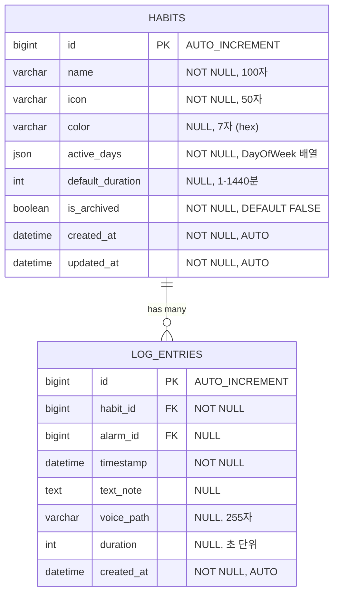
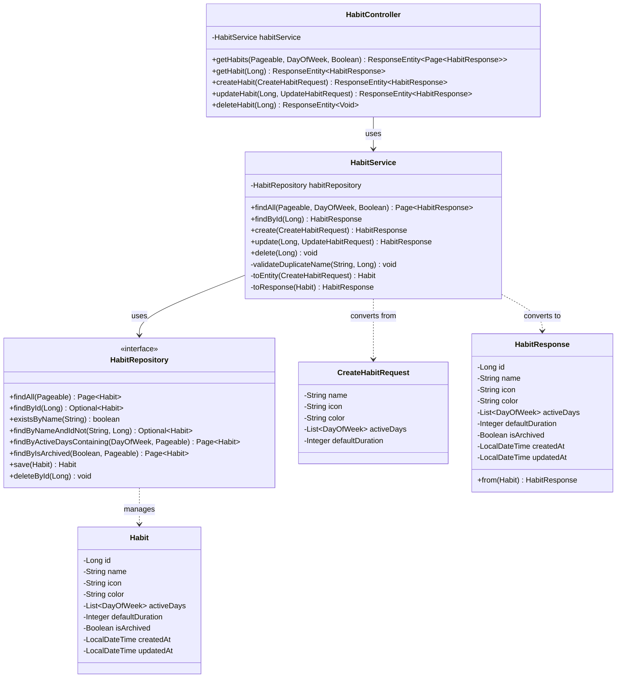

# #003: 습관 관리 데이터 및 로직 구현

**Epic:** EPIC-2 (HABIT_MGMT)  
**Type:** Functional  
**Priority:** P0 (Critical)  
**Labels:** `epic:habit`, `type:backend`, `type:database`  
**Related REQ:** REQ-FUNC-001, REQ-FUNC-002, REQ-FUNC-003  
**Dependencies:** #001 ✅ (완료)  
**Parallelizable With:** #004, #011  
**Blocks:** #005, #007, #009

---

## 📋 Description

사용자가 습관을 생성, 수정, 삭제할 수 있는 데이터 레이어와 비즈니스 로직을 구현합니다.

## 📌 Scope / Out of Scope

### In Scope
- Habit Entity 및 Repository 구현
- 습관 CRUD API (생성, 조회, 수정, 삭제)
- 습관 활성 요일 설정 및 필터링
- Soft Delete (아카이브) 기능
- 입력값 유효성 검사 및 예외 처리
- 기본적인 단위 테스트 및 통합 테스트

### Out of Scope
- 사용자 인증/인가 (별도 이슈에서 처리)
- 습관 통계 및 분석 (#007에서 처리)
- 습관 목표 설정 (#007에서 처리)
- 습관 로그 기록 (#005에서 처리)
- 프론트엔드 UI 구현 (별도 프로젝트에서 완료)

## 🎯 Goals

- Habit Entity 및 Repository 구현
- 습관 CRUD API 구현
- 습관 활성 요일 설정 기능 구현
- 습관 관리 비즈니스 로직 구현

## 🛠️ Technical Stack

**Backend Core:**
- Java 21 LTS
- Spring Boot 4.0.1
- Spring Data JPA / Hibernate 7.2.0
- Gradle 9.2.1

**Database:**
- MySQL 8.x (Production)
- H2 Database (Development/Testing)

**API:**
- RESTful API (JSON)
- OpenAPI 3.0 (Swagger/SpringDoc)

**Validation:**
- Jakarta Bean Validation (`@Valid`, `@NotBlank`, `@Size`, etc.)

**Testing:**
- JUnit 5
- Mockito
- Spring Boot Test

## ✅ Tasks

### TASK-HABIT-DB-01: Habit Entity
- [ ] `Habit` JPA Entity 설계 및 구현
  - [ ] 필드: `id`, `name`, `icon`, `color`, `activeDays`, `defaultDuration`, `isArchived`
  - [ ] `@Entity`, `@Table` 어노테이션 적용
  - [ ] `@CreatedDate`, `@LastModifiedDate` 적용
- [ ] `HabitRepository` 인터페이스 생성
- [ ] 기본 CRUD 쿼리 메서드 정의
- [ ] 요일별 활성 습관 필터링 쿼리 구현

### TASK-HABIT-SERVICE-01: Habit Service
- [ ] `HabitService` 클래스 구현
- [ ] 습관 생성 로직 구현 (`@Transactional`)
  1. Request Validation (Controller Layer에서 `@Valid` 처리)
  2. Business Validation: 중복 이름 체크 (`existsByName()`)
     - 실패 시: `HabitAlreadyExistsException` → `409 Conflict`
  3. Entity 생성: DTO → Entity 변환, 기본값 설정
  4. 저장: `repository.save(habit)`
  5. 응답 생성: Entity → Response DTO 변환, `201 Created` 반환
- [ ] 습관 수정 로직 구현 (`@Transactional`)
  1. 리소스 존재 확인: `findById(id)` → 없으면 `404 Not Found`
  2. Business Validation: 중복 이름 체크 (자신 제외)
  3. Entity 업데이트: DTO 필드로 부분 업데이트
  4. 저장 및 응답: `200 OK` 반환
- [ ] 습관 삭제 로직 구현 (`@Transactional`)
  1. 리소스 존재 확인: `findById(id)` → 없으면 `404 Not Found`
  2. Soft Delete 처리: `isArchived = true` 설정
  3. 저장 및 응답: `204 No Content` 반환
- [ ] 요일별 활성 습관 조회 로직 구현 (`@Transactional(readOnly = true)`)
  1. 쿼리 파라미터 파싱 및 검증 (`dayOfWeek`: MONDAY ~ SUNDAY)
  2. Repository 쿼리 실행: `findByActiveDaysContaining(dayOfWeek)`
  3. 필터링: `archived=false` 습관만 반환
  4. 정렬 및 페이지네이션 처리
  5. 응답 생성: `200 OK` with `Page<HabitResponse>`

### TASK-HABIT-CONTROLLER-01: Habit Controller
- [ ] `HabitController` 클래스 구현
- [ ] `GET /api/v1/habits` - 습관 목록 조회
  - Query Parameters: `?dayOfWeek=MONDAY&archived=false&page=0&size=20&sort=createdAt,desc`
  - Response: `200 OK` with `Page<HabitResponse>`
- [ ] `GET /api/v1/habits/{id}` - 습관 상세 조회
  - Response: `200 OK` with `HabitResponse` or `404 Not Found`
- [ ] `POST /api/v1/habits` - 습관 생성
  - Request Body: `CreateHabitRequest`
  - Response: `201 Created` with `HabitResponse` and `Location` header
- [ ] `PUT /api/v1/habits/{id}` - 습관 수정
  - Request Body: `UpdateHabitRequest`
  - Response: `200 OK` with `HabitResponse` or `404 Not Found`
- [ ] `DELETE /api/v1/habits/{id}` - 습관 삭제
  - Response: `204 No Content` or `404 Not Found`
- [ ] Request/Response DTO 구현
- [ ] `@Valid` 어노테이션을 통한 입력 검증

### TASK-HABIT-DTO-01: Request/Response DTOs
- [ ] `CreateHabitRequest` 구현
  - `name` (String, 필수): `@NotBlank`, `@Size(min=1, max=100)`
  - `icon` (String, 필수): `@NotBlank`, `@Size(max=50)`
  - `color` (String, 선택): `@Pattern(regexp="^#[0-9A-Fa-f]{6}$")`, 기본값 `#4A90E2`
  - `activeDays` (List<DayOfWeek>, 필수): `@NotEmpty`, `@Size(min=1, max=7)`
  - `defaultDuration` (Integer, 선택): `@Min(1)`, `@Max(1440)`, 기본값 `30` (단위: 분)
- [ ] `UpdateHabitRequest` 구현
  - 모든 필드 선택적 (Optional)
  - `isArchived` (Boolean, 선택) 추가
- [ ] `HabitResponse` 구현
  - 모든 필드 포함 (id, name, icon, color, activeDays, defaultDuration, isArchived, createdAt, updatedAt)
  - `from(Habit)` 정적 팩토리 메서드 구현

### TASK-HABIT-TEST-01: Habit Tests
- [ ] `HabitService` 단위 테스트 작성
- [ ] `HabitRepository` 통합 테스트 작성
- [ ] `HabitController` API 테스트 작성
- [ ] 요일 필터링 로직 테스트

## 📝 Acceptance Criteria

- [ ] 습관 생성 API가 정상 작동함
- [ ] 습관 수정/삭제 API가 정상 작동함
- [ ] 요일별 활성 습관 필터링이 정상 작동함
- [ ] 입력값 유효성 검사가 정상 작동함
- [ ] 단위 테스트 커버리지 80% 이상
- [ ] API 문서(Swagger)에 정상 반영됨

---

## 📡 API 명세 상세

### 1. Endpoint 명세

#### GET /api/v1/habits
**설명:** 습관 목록 조회 (페이지네이션 지원)

**Query Parameters:**
- `dayOfWeek` (String, 선택): 필터링할 요일 (MONDAY, TUESDAY, ..., SUNDAY)
- `archived` (Boolean, 선택): 아카이브 여부 필터 (기본값: `false`)
- `page` (Integer, 선택): 페이지 번호 (기본값: `0`)
- `size` (Integer, 선택): 페이지 크기 (기본값: `20`)
- `sort` (String, 선택): 정렬 기준 (예: `createdAt,desc`)

**Response:**
- `200 OK`: `Page<HabitResponse>`
- `400 Bad Request`: 잘못된 쿼리 파라미터

#### GET /api/v1/habits/{id}
**설명:** 습관 상세 조회

**Path Parameters:**
- `id` (Long, 필수): 습관 ID

**Response:**
- `200 OK`: `HabitResponse`
- `404 Not Found`: 습관을 찾을 수 없음

#### POST /api/v1/habits
**설명:** 습관 생성

**Request Body:** `CreateHabitRequest` (JSON)

**Response:**
- `201 Created`: `HabitResponse` + `Location: /api/v1/habits/{id}` 헤더
- `400 Bad Request`: Validation 실패
- `409 Conflict`: 중복된 습관 이름

#### PUT /api/v1/habits/{id}
**설명:** 습관 수정

**Path Parameters:**
- `id` (Long, 필수): 습관 ID

**Request Body:** `UpdateHabitRequest` (JSON)

**Response:**
- `200 OK`: `HabitResponse`
- `400 Bad Request`: Validation 실패
- `404 Not Found`: 습관을 찾을 수 없음
- `409 Conflict`: 중복된 습관 이름

#### DELETE /api/v1/habits/{id}
**설명:** 습관 삭제 (Soft Delete)

**Path Parameters:**
- `id` (Long, 필수): 습관 ID

**Response:**
- `204 No Content`: 삭제 성공
- `404 Not Found`: 습관을 찾을 수 없음

---

### 2. Request Body 명세

#### CreateHabitRequest
```json
{
  "name": "명상",
  "icon": "🧘",
  "color": "#4A90E2",
  "activeDays": ["MONDAY", "WEDNESDAY", "FRIDAY"],
  "defaultDuration": 30
}
```

**필드 상세:**
| 필드명 | 타입 | 필수 | 제약 조건 | 설명 |
|--------|------|------|----------|------|
| `name` | String | ✅ | `@NotBlank`, `@Size(min=1, max=100)` | 습관 이름 |
| `icon` | String | ✅ | `@NotBlank`, `@Size(max=50)` | 아이콘 (이모지 또는 아이콘 코드) |
| `color` | String | ❌ | `@Pattern(regexp="^#[0-9A-Fa-f]{6}$")` | Hex 색상 코드 (기본값: `#4A90E2`) |
| `activeDays` | List<DayOfWeek> | ✅ | `@NotEmpty`, `@Size(min=1, max=7)` | 활성 요일 목록 (MONDAY ~ SUNDAY) |
| `defaultDuration` | Integer | ❌ | `@Min(1)`, `@Max(1440)` | 기본 지속 시간 (분 단위, 기본값: `30`) |

#### UpdateHabitRequest
```json
{
  "name": "명상 (수정)",
  "icon": "🧘‍♀️",
  "color": "#FF6B6B",
  "activeDays": ["MONDAY", "TUESDAY", "WEDNESDAY", "THURSDAY", "FRIDAY"],
  "defaultDuration": 45,
  "isArchived": false
}
```

**필드 상세:**
- 모든 필드 선택적 (Optional)
- `isArchived` 필드 추가 (Boolean)

---

### 3. Response Body 명세

#### HabitResponse (성공 응답)
```json
{
  "id": 1,
  "name": "명상",
  "icon": "🧘",
  "color": "#4A90E2",
  "activeDays": ["MONDAY", "WEDNESDAY", "FRIDAY"],
  "defaultDuration": 30,
  "isArchived": false,
  "createdAt": "2025-01-15T10:30:00",
  "updatedAt": "2025-01-15T10:30:00"
}
```

#### ErrorResponse (실패 응답)
```json
{
  "code": "VALIDATION_001",
  "message": "Validation failed",
  "fieldErrors": [
    {
      "field": "name",
      "message": "Habit name is required"
    }
  ],
  "timestamp": "2025-01-15T10:30:00"
}
```

**HTTP Status Codes:**
- `200 OK`: GET, PUT 성공
- `201 Created`: POST 성공 (Location 헤더 포함)
- `204 No Content`: DELETE 성공
- `400 Bad Request`: Validation 실패
- `404 Not Found`: 리소스 없음
- `409 Conflict`: 중복 이름
- `500 Internal Server Error`: 서버 오류

---

### 4. Logic Steps (런타임 처리 순서)

#### POST /api/v1/habits - 습관 생성

**실행 순서:**
1. **HTTP Request 수신** (Controller)
   - `@PostMapping` 핸들러 메서드 호출
   - Request Body를 `CreateHabitRequest` DTO로 역직렬화

2. **Request Validation** (Controller Layer)
   - `@Valid` 어노테이션으로 DTO 검증 실행
   - `@NotBlank`, `@Size`, `@Pattern` 등 검증 어노테이션 체크
   - 실패 시: `MethodArgumentNotValidException` → `GlobalExceptionHandler` → `400 Bad Request` 반환

3. **Service 메서드 호출** (`HabitService.create()`)
   - Controller → Service 의존성 주입 호출

4. **트랜잭션 시작** (`@Transactional`)
   - Spring AOP가 트랜잭션 시작

5. **Business Validation** (Service Layer)
   - `habitRepository.existsByName(request.getName())` 실행
   - 중복 발견 시: `HabitAlreadyExistsException` throw → `409 Conflict` 반환

6. **Entity 생성** (Service Layer)
   - `Habit.builder()` 사용하여 Entity 생성
   - 기본값 설정: `color = request.getColor() != null ? request.getColor() : "#4A90E2"`
   - 기본값 설정: `defaultDuration = request.getDefaultDuration() != null ? request.getDefaultDuration() : 30`
   - `activeDays` 리스트 설정

7. **데이터베이스 저장** (Repository Layer)
   - `habitRepository.save(habit)` 실행
   - JPA가 INSERT 쿼리 생성 및 실행
   - `@CreatedDate`, `@LastModifiedDate` 자동 설정 (JPA Auditing)

8. **트랜잭션 커밋** (`@Transactional`)
   - Spring AOP가 트랜잭션 커밋

9. **Entity → DTO 변환** (Service Layer)
   - `HabitResponse.from(savedHabit)` 정적 팩토리 메서드 호출
   - Entity의 모든 필드를 DTO로 복사

10. **HTTP Response 생성** (Controller)
    - `ResponseEntity.status(HttpStatus.CREATED).location(location).body(habitResponse)` 생성
    - `Location: /api/v1/habits/{id}` 헤더 추가
    - `201 Created` 상태 코드와 함께 응답 반환

#### PUT /api/v1/habits/{id} - 습관 수정

**실행 순서:**
1. **HTTP Request 수신** (Controller)
   - `@PutMapping("/{id}")` 핸들러 메서드 호출
   - Path Variable `id` 추출 및 `Long` 타입 변환
   - Request Body를 `UpdateHabitRequest` DTO로 역직렬화

2. **Request Validation** (Controller Layer)
   - `@Valid` 어노테이션으로 DTO 검증 (선택적 필드이므로 빈 값 허용)

3. **Service 메서드 호출** (`HabitService.update(id, request)`)

4. **트랜잭션 시작** (`@Transactional`)

5. **리소스 존재 확인** (Service Layer)
   - `habitRepository.findById(id)` 실행
   - `Optional<Habit>` 반환
   - 없으면: `HabitNotFoundException` throw → `404 Not Found` 반환

6. **Business Validation** (Service Layer)
   - 이름 변경 시: `habitRepository.findByNameAndIdNot(newName, id).isPresent()` 체크
   - 중복 발견 시: `HabitAlreadyExistsException` throw → `409 Conflict` 반환

7. **Entity 부분 업데이트** (Service Layer)
   - `request.getName() != null` → `habit.setName(request.getName())`
   - `request.getIcon() != null` → `habit.setIcon(request.getIcon())`
   - `request.getColor() != null` → `habit.setColor(request.getColor())`
   - `request.getActiveDays() != null` → `habit.setActiveDays(request.getActiveDays())`
   - `request.getDefaultDuration() != null` → `habit.setDefaultDuration(request.getDefaultDuration())`
   - `request.getIsArchived() != null` → `habit.setIsArchived(request.getIsArchived())`

8. **데이터베이스 저장** (Repository Layer)
   - `habitRepository.save(habit)` 실행
   - JPA가 UPDATE 쿼리 생성 및 실행
   - `@LastModifiedDate` 자동 갱신 (JPA Auditing)

9. **트랜잭션 커밋** (`@Transactional`)

10. **Entity → DTO 변환 및 응답** (Service → Controller)
    - `HabitResponse.from(updatedHabit)` 호출
    - `200 OK` 상태 코드와 함께 응답 반환

#### DELETE /api/v1/habits/{id} - 습관 삭제 (Soft Delete)

**실행 순서:**
1. **HTTP Request 수신** (Controller)
   - `@DeleteMapping("/{id}")` 핸들러 메서드 호출
   - Path Variable `id` 추출

2. **Service 메서드 호출** (`HabitService.delete(id)`)

3. **트랜잭션 시작** (`@Transactional`)

4. **리소스 존재 확인** (Service Layer)
   - `habitRepository.findById(id)` 실행
   - 없으면: `HabitNotFoundException` throw → `404 Not Found` 반환

5. **Soft Delete 처리** (Service Layer)
   - `habit.setIsArchived(true)` 실행

6. **데이터베이스 저장** (Repository Layer)
   - `habitRepository.save(habit)` 실행
   - JPA가 UPDATE 쿼리 생성: `UPDATE habits SET is_archived = true WHERE id = ?`

7. **트랜잭션 커밋** (`@Transactional`)

8. **HTTP Response 생성** (Controller)
   - `ResponseEntity.noContent().build()` 생성
   - `204 No Content` 상태 코드와 함께 응답 반환

#### GET /api/v1/habits?dayOfWeek=MONDAY - 요일별 조회

**실행 순서:**
1. **HTTP Request 수신** (Controller)
   - `@GetMapping` 핸들러 메서드 호출
   - Query Parameter `dayOfWeek` 추출 및 `DayOfWeek` Enum 변환
   - Query Parameter `archived`, `page`, `size`, `sort` 추출

2. **Service 메서드 호출** (`HabitService.findAll(dayOfWeek, archived, pageable)`)

3. **읽기 전용 트랜잭션 시작** (`@Transactional(readOnly = true)`)

4. **쿼리 파라미터 검증** (Service Layer)
   - `dayOfWeek`가 `null`이 아니면 `MONDAY` ~ `SUNDAY` 범위 검증

5. **Repository 쿼리 실행** (Repository Layer)
   - `dayOfWeek != null` → `habitRepository.findByActiveDaysContaining(dayOfWeek, pageable)` 실행
   - JPQL 쿼리: `SELECT DISTINCT h FROM Habit h JOIN h.activeDays ad WHERE ad = :dayOfWeek AND h.isArchived = false`
   - SQL 변환: `SELECT DISTINCT h.* FROM habits h INNER JOIN habit_active_days had ON h.id = had.habit_id WHERE had.day_of_week = 'MONDAY' AND h.is_archived = false LIMIT ? OFFSET ?`

6. **데이터베이스 쿼리 실행** (Database)
   - MySQL/H2에서 쿼리 실행
   - 결과 반환

7. **Entity → DTO 변환** (Service Layer)
   - `Page<Habit>` → `Page<HabitResponse>` 변환
   - `habits.map(HabitResponse::from)` 실행

8. **읽기 전용 트랜잭션 종료** (`@Transactional(readOnly = true)`)

9. **HTTP Response 생성** (Controller)
   - `ResponseEntity.ok(pageResponse)` 생성
   - `200 OK` 상태 코드와 함께 페이지네이션 정보 포함 응답 반환

---

## 📊 Difficulty Assessment (난이도 평가)

### 전체 난이도: **중 (Medium)**

**단일 에이전트 작업 단위:** 이 이슈는 한 명의 개발자가 2-3일 내에 독립적으로 완료할 수 있는 작업 단위입니다.

### 세부 난이도 분석

| Task | 난이도 | 예상 시간 | 주요 작업량 | 비고 |
|------|--------|----------|------------|------|
| **TASK-HABIT-DB-01** | 하 (Low) | 2-3시간 | Entity 설계, Repository 인터페이스 | 기본 JPA Entity, 표준 패턴 |
| **TASK-HABIT-SERVICE-01** | 중 (Medium) | 4-6시간 | 비즈니스 로직, 예외 처리, 트랜잭션 관리 | 중복 체크, Soft Delete 로직 |
| **TASK-HABIT-CONTROLLER-01** | 중 (Medium) | 3-4시간 | REST API 엔드포인트, DTO 매핑, 검증 | 5개 엔드포인트 구현 |
| **TASK-HABIT-DTO-01** | 하 (Low) | 2-3시간 | Request/Response DTO 설계 및 구현 | 3개 DTO 클래스 |
| **TASK-HABIT-TEST-01** | 중 (Medium) | 4-6시간 | 단위/통합/API 테스트 작성 | 테스트 커버리지 80% 목표 |

**총 예상 시간: 16-24시간 (2-3일)**

### 난이도 상세

#### 하 (Low) - 1-3시간
- **Entity 설계**: 표준 JPA 패턴 사용 (`@Entity`, `@Table`, `@Column`)
- **Repository 인터페이스**: Spring Data JPA 기본 메서드 + 커스텀 쿼리
- **DTO 구현**: Lombok 사용, 정적 팩토리 메서드 패턴

#### 중 (Medium) - 3-6시간
- **비즈니스 로직**: 중복 체크, Soft Delete, 요일 필터링
- **예외 처리**: 커스텀 예외 클래스 및 GlobalExceptionHandler 연동
- **트랜잭션 관리**: `@Transactional` 어노테이션 사용
- **테스트 작성**: Mockito를 사용한 단위 테스트, Spring Boot Test를 사용한 통합 테스트

#### 상 (High) - 없음
- 복잡한 알고리즘이나 외부 시스템 연동 없음
- 표준적인 CRUD 작업 위주

### 작업량 분해

**Day 1 (6-8시간):**
- Entity 및 Repository 구현 (3시간)
- DTO 구현 (2시간)
- Service 기본 구조 및 생성 로직 (3-4시간)

**Day 2 (6-8시간):**
- Service 수정/삭제/조회 로직 (4시간)
- Controller 구현 (3-4시간)

**Day 3 (4-8시간):**
- 테스트 작성 (4-6시간)
- 버그 수정 및 리팩토링 (2시간)

---

## 🗄️ 데이터 아키텍처 설계

### 1. ERD (Entity Relationship Diagram)

**데이터베이스 관점: 데이터가 어떻게 저장될 것인가?**



**테이블 구조 상세:**

#### `habits` 테이블
| 컬럼명 | 타입 | 제약조건 | 설명 |
|--------|------|----------|------|
| `id` | BIGINT | PRIMARY KEY, AUTO_INCREMENT | 습관 고유 식별자 |
| `name` | VARCHAR(100) | NOT NULL, UNIQUE | 습관 이름 (중복 불가) |
| `icon` | VARCHAR(50) | NOT NULL | 아이콘 (이모지 또는 아이콘 코드) |
| `color` | VARCHAR(7) | NULL, DEFAULT '#4A90E2' | Hex 색상 코드 (#RRGGBB) |
| `active_days` | JSON | NOT NULL | 활성 요일 배열 (예: ["MONDAY", "WEDNESDAY"]) |
| `default_duration` | INT | NULL, DEFAULT 30 | 기본 지속 시간 (분 단위, 1-1440) |
| `is_archived` | BOOLEAN | NOT NULL, DEFAULT FALSE | 아카이브 여부 (Soft Delete) |
| `created_at` | DATETIME | NOT NULL | 생성 일시 |
| `updated_at` | DATETIME | NOT NULL | 수정 일시 |

**인덱스:**
- `PRIMARY KEY (id)`
- `UNIQUE KEY uk_habits_name (name)`
- `INDEX idx_habits_active_days (active_days)` - 요일 필터링 최적화
- `INDEX idx_habits_archived (is_archived)` - 아카이브 필터링 최적화

**관계:**
- `HABITS` 1:N `LOG_ENTRIES` (하나의 습관은 여러 로그 엔트리를 가짐)

---

### 2. CLD (Class/Component Logic Diagram)

**백엔드 서버 관점: 데이터가 어떻게 가공될 것인가?**



**3-Tier 아키텍처 흐름:**

```
┌─────────────────────────────────────────────────────────────┐
│                    Controller Layer                          │
│  ┌──────────────────────────────────────────────────────┐   │
│  │ HabitController                                      │   │
│  │  - HTTP 요청/응답 처리                               │   │
│  │  - DTO 검증 (@Valid)                                 │   │
│  │  - HTTP 상태 코드 관리                               │   │
│  └──────────────────────────────────────────────────────┘   │
└───────────────────────────┬─────────────────────────────────┘
                            │
                            ▼
┌─────────────────────────────────────────────────────────────┐
│                     Service Layer                            │
│  ┌──────────────────────────────────────────────────────┐   │
│  │ HabitService                                          │   │
│  │  - 비즈니스 로직 처리                                 │   │
│  │  - 트랜잭션 관리 (@Transactional)                     │   │
│  │  - 예외 처리 (HabitNotFoundException 등)              │   │
│  │  - DTO ↔ Entity 변환                                  │   │
│  └──────────────────────────────────────────────────────┘   │
└───────────────────────────┬─────────────────────────────────┘
                            │
                            ▼
┌─────────────────────────────────────────────────────────────┐
│                   Repository Layer                          │
│  ┌──────────────────────────────────────────────────────┐   │
│  │ HabitRepository                                       │   │
│  │  - 데이터 접근 (JPA)                                  │   │
│  │  - 쿼리 메서드 (Query Methods)                        │   │
│  │  - 커스텀 쿼리 (@Query)                               │   │
│  └──────────────────────────────────────────────────────┘   │
└───────────────────────────┬─────────────────────────────────┘
                            │
                            ▼
┌─────────────────────────────────────────────────────────────┐
│                    Database (MySQL)                          │
│  ┌──────────────────────────────────────────────────────┐   │
│  │ habits 테이블                                         │   │
│  │  - 데이터 영구 저장                                   │   │
│  │  - 인덱스 최적화                                      │   │
│  └──────────────────────────────────────────────────────┘   │
└─────────────────────────────────────────────────────────────┘
```

**데이터 흐름 (습관 생성 예시):**

1. **Controller**: `POST /api/v1/habits` 요청 수신
   - `CreateHabitRequest` DTO 검증 (`@Valid`)
   - 실패 시: `400 Bad Request` 반환

2. **Service**: 비즈니스 로직 처리
   - 중복 이름 체크 (`existsByName()`)
   - 실패 시: `HabitAlreadyExistsException` → `409 Conflict`
   - DTO → Entity 변환
   - 기본값 설정 (color, defaultDuration)

3. **Repository**: 데이터 저장
   - `save(habit)` 호출
   - JPA가 SQL INSERT 생성 및 실행
   - 트랜잭션 커밋

4. **Service**: 응답 생성
   - Entity → Response DTO 변환
   - `HabitResponse` 반환

5. **Controller**: HTTP 응답
   - `201 Created` + `Location` 헤더
   - `HabitResponse` 본문 반환

---

### 3. ORM 예제코드 (Object Relational Mapping)

**서버가 데이터베이스를 조회하는 연결적 관점: 실제 구현 코드**

#### 3.1 JPA Entity (데이터베이스 테이블 매핑)

```java
package vibe.selfdevleop.selfdevleop_backend_prepare.entity;

import jakarta.persistence.*;
import lombok.*;
import org.springframework.data.annotation.CreatedDate;
import org.springframework.data.annotation.LastModifiedDate;
import org.springframework.data.jpa.domain.support.AuditingEntityListener;

import java.time.DayOfWeek;
import java.time.LocalDateTime;
import java.util.ArrayList;
import java.util.List;

/**
 * 습관 엔티티
 * 
 * @Entity: JPA 엔티티로 인식
 * @Table: 데이터베이스 테이블명 지정
 * @EntityListeners: Auditing 기능 활성화 (createdAt, updatedAt 자동 설정)
 */
@Entity
@Table(name = "habits", indexes = {
    @Index(name = "idx_habits_active_days", columnList = "active_days"),
    @Index(name = "idx_habits_archived", columnList = "is_archived")
})
@EntityListeners(AuditingEntityListener.class)
@Getter
@Setter
@NoArgsConstructor(access = AccessLevel.PROTECTED)
@AllArgsConstructor
@Builder
public class Habit {
    
    /**
     * 습관 고유 식별자
     * @Id: Primary Key 지정
     * @GeneratedValue: 자동 증가 전략 (IDENTITY = AUTO_INCREMENT)
     */
    @Id
    @GeneratedValue(strategy = GenerationType.IDENTITY)
    @Column(name = "id")
    private Long id;
    
    /**
     * 습관 이름 (중복 불가)
     * @Column: 컬럼 제약조건 설정
     */
    @Column(name = "name", nullable = false, length = 100, unique = true)
    private String name;
    
    /**
     * 아이콘 (이모지 또는 아이콘 코드)
     */
    @Column(name = "icon", nullable = false, length = 50)
    private String icon;
    
    /**
     * Hex 색상 코드 (#RRGGBB)
     * 기본값: #4A90E2
     */
    @Column(name = "color", length = 7)
    @Builder.Default
    private String color = "#4A90E2";
    
    /**
     * 활성 요일 목록
     * @ElementCollection: 컬렉션 타입 매핑
     * @Enumerated: Enum을 문자열로 저장
     * @CollectionTable: 컬렉션 테이블 설정
     */
    @ElementCollection(targetClass = DayOfWeek.class, fetch = FetchType.EAGER)
    @Enumerated(EnumType.STRING)
    @CollectionTable(name = "habit_active_days", joinColumns = @JoinColumn(name = "habit_id"))
    @Column(name = "day_of_week", nullable = false)
    private List<DayOfWeek> activeDays = new ArrayList<>();
    
    /**
     * 기본 지속 시간 (분 단위, 1-1440)
     * 기본값: 30분
     */
    @Column(name = "default_duration")
    @Builder.Default
    private Integer defaultDuration = 30;
    
    /**
     * 아카이브 여부 (Soft Delete)
     * 기본값: false
     */
    @Column(name = "is_archived", nullable = false)
    @Builder.Default
    private Boolean isArchived = false;
    
    /**
     * 생성 일시 (자동 설정)
     * @CreatedDate: 엔티티 생성 시 자동 설정
     */
    @CreatedDate
    @Column(name = "created_at", nullable = false, updatable = false)
    private LocalDateTime createdAt;
    
    /**
     * 수정 일시 (자동 설정)
     * @LastModifiedDate: 엔티티 수정 시 자동 갱신
     */
    @LastModifiedDate
    @Column(name = "updated_at", nullable = false)
    private LocalDateTime updatedAt;
    
    /**
     * 연관된 로그 엔트리 (향후 #005에서 사용)
     * @OneToMany: 1:N 관계
     * @mappedBy: 양방향 관계에서 주인 지정
     * @fetch = LAZY: 지연 로딩 (성능 최적화)
     */
    @OneToMany(mappedBy = "habit", fetch = FetchType.LAZY, cascade = CascadeType.ALL)
    private List<LogEntry> logEntries = new ArrayList<>();
}
```

#### 3.2 Repository 인터페이스 (데이터 접근 계층)

```java
package vibe.selfdevleop.selfdevleop_backend_prepare.repository;

import org.springframework.data.domain.Page;
import org.springframework.data.domain.Pageable;
import org.springframework.data.jpa.repository.JpaRepository;
import org.springframework.data.jpa.repository.Query;
import org.springframework.data.repository.query.Param;
import org.springframework.stereotype.Repository;
import vibe.selfdevleop.selfdevleop_backend_prepare.entity.Habit;

import java.time.DayOfWeek;
import java.util.Optional;

/**
 * 습관 데이터 접근 계층
 * 
 * @Repository: Spring Data JPA Repository로 인식
 * JpaRepository<Habit, Long>: 기본 CRUD 메서드 제공
 *   - Habit: 엔티티 타입
 *   - Long: Primary Key 타입
 */
@Repository
public interface HabitRepository extends JpaRepository<Habit, Long> {
    
    /**
     * 이름으로 습관 존재 여부 확인
     * Spring Data JPA가 메서드명으로 쿼리 자동 생성
     * SQL: SELECT COUNT(*) > 0 FROM habits WHERE name = ?
     */
    boolean existsByName(String name);
    
    /**
     * 이름으로 습관 조회 (중복 체크용)
     * SQL: SELECT * FROM habits WHERE name = ? LIMIT 1
     */
    Optional<Habit> findByName(String name);
    
    /**
     * 이름과 ID로 습관 조회 (수정 시 중복 체크용, 자신 제외)
     * SQL: SELECT * FROM habits WHERE name = ? AND id != ? LIMIT 1
     */
    Optional<Habit> findByNameAndIdNot(String name, Long id);
    
    /**
     * 아카이브 여부로 습관 목록 조회 (페이지네이션)
     * SQL: SELECT * FROM habits WHERE is_archived = ? LIMIT ? OFFSET ?
     */
    Page<Habit> findByIsArchived(Boolean isArchived, Pageable pageable);
    
    /**
     * 활성 요일에 포함된 습관 목록 조회 (커스텀 쿼리)
     * 
     * @Query: JPQL 쿼리 직접 작성
     * @Param: 파라미터 바인딩
     * 
     * SQL 변환:
     * SELECT h.* FROM habits h
     * INNER JOIN habit_active_days had ON h.id = had.habit_id
     * WHERE had.day_of_week = ? AND h.is_archived = false
     * LIMIT ? OFFSET ?
     */
    @Query("SELECT DISTINCT h FROM Habit h " +
           "JOIN h.activeDays ad " +
           "WHERE ad = :dayOfWeek AND h.isArchived = false")
    Page<Habit> findByActiveDaysContaining(
        @Param("dayOfWeek") DayOfWeek dayOfWeek,
        Pageable pageable
    );
    
    /**
     * 요일 필터링 + 아카이브 필터링 조합 쿼리
     */
    @Query("SELECT DISTINCT h FROM Habit h " +
           "JOIN h.activeDays ad " +
           "WHERE (:dayOfWeek IS NULL OR ad = :dayOfWeek) " +
           "AND (:archived IS NULL OR h.isArchived = :archived)")
    Page<Habit> findByFilters(
        @Param("dayOfWeek") DayOfWeek dayOfWeek,
        @Param("archived") Boolean archived,
        Pageable pageable
    );
}
```

#### 3.3 Service 구현 (비즈니스 로직 계층)

```java
package vibe.selfdevleop.selfdevleop_backend_prepare.service;

import lombok.RequiredArgsConstructor;
import lombok.extern.slf4j.Slf4j;
import org.springframework.data.domain.Page;
import org.springframework.data.domain.Pageable;
import org.springframework.stereotype.Service;
import org.springframework.transaction.annotation.Transactional;
import vibe.selfdevleop.selfdevleop_backend_prepare.dto.request.CreateHabitRequest;
import vibe.selfdevleop.selfdevleop_backend_prepare.dto.request.UpdateHabitRequest;
import vibe.selfdevleop.selfdevleop_backend_prepare.dto.response.HabitResponse;
import vibe.selfdevleop.selfdevleop_backend_prepare.entity.Habit;
import vibe.selfdevleop.selfdevleop_backend_prepare.exception.HabitAlreadyExistsException;
import vibe.selfdevleop.selfdevleop_backend_prepare.exception.HabitNotFoundException;
import vibe.selfdevleop.selfdevleop_backend_prepare.repository.HabitRepository;

import java.time.DayOfWeek;

/**
 * 습관 관리 서비스
 * 
 * @Service: Spring Service Bean으로 등록
 * @RequiredArgsConstructor: final 필드에 대한 생성자 자동 생성 (의존성 주입)
 * @Transactional: 트랜잭션 관리 (기본값: readOnly = false)
 */
@Service
@RequiredArgsConstructor
@Slf4j
@Transactional(readOnly = true)
public class HabitService {
    
    private final HabitRepository habitRepository;
    
    /**
     * 습관 목록 조회 (페이지네이션, 필터링 지원)
     * 
     * @param dayOfWeek 요일 필터 (선택)
     * @param archived 아카이브 필터 (선택)
     * @param pageable 페이지네이션 정보
     * @return 습관 목록 (페이지네이션)
     */
    public Page<HabitResponse> findAll(DayOfWeek dayOfWeek, Boolean archived, Pageable pageable) {
        log.debug("Finding habits with filters - dayOfWeek: {}, archived: {}", dayOfWeek, archived);
        
        Page<Habit> habits;
        
        // 필터 조합에 따라 적절한 쿼리 메서드 선택
        if (dayOfWeek != null && archived != null) {
            habits = habitRepository.findByFilters(dayOfWeek, archived, pageable);
        } else if (dayOfWeek != null) {
            habits = habitRepository.findByActiveDaysContaining(dayOfWeek, pageable);
        } else if (archived != null) {
            habits = habitRepository.findByIsArchived(archived, pageable);
        } else {
            habits = habitRepository.findAll(pageable);
        }
        
        // Entity → DTO 변환
        return habits.map(HabitResponse::from);
    }
    
    /**
     * 습관 상세 조회
     * 
     * @param id 습관 ID
     * @return 습관 상세 정보
     * @throws HabitNotFoundException 습관을 찾을 수 없을 때
     */
    public HabitResponse findById(Long id) {
        log.debug("Finding habit by id: {}", id);
        
        Habit habit = habitRepository.findById(id)
            .orElseThrow(() -> new HabitNotFoundException(id));
        
        return HabitResponse.from(habit);
    }
    
    /**
     * 습관 생성
     * 
     * @param request 생성 요청 DTO
     * @return 생성된 습관 정보
     * @throws HabitAlreadyExistsException 중복된 이름일 때
     */
    @Transactional
    public HabitResponse create(CreateHabitRequest request) {
        log.debug("Creating habit with name: {}", request.getName());
        
        // 1. 비즈니스 검증: 중복 이름 체크
        validateDuplicateName(request.getName(), null);
        
        // 2. DTO → Entity 변환
        Habit habit = toEntity(request);
        
        // 3. 저장 (트랜잭션 커밋)
        Habit savedHabit = habitRepository.save(habit);
        
        log.info("Habit created successfully - id: {}, name: {}", savedHabit.getId(), savedHabit.getName());
        
        // 4. Entity → DTO 변환
        return HabitResponse.from(savedHabit);
    }
    
    /**
     * 습관 수정
     * 
     * @param id 습관 ID
     * @param request 수정 요청 DTO
     * @return 수정된 습관 정보
     * @throws HabitNotFoundException 습관을 찾을 수 없을 때
     * @throws HabitAlreadyExistsException 중복된 이름일 때
     */
    @Transactional
    public HabitResponse update(Long id, UpdateHabitRequest request) {
        log.debug("Updating habit - id: {}, name: {}", id, request.getName());
        
        // 1. 리소스 존재 확인
        Habit habit = habitRepository.findById(id)
            .orElseThrow(() -> new HabitNotFoundException(id));
        
        // 2. 비즈니스 검증: 중복 이름 체크 (자신 제외)
        if (request.getName() != null && !request.getName().equals(habit.getName())) {
            validateDuplicateName(request.getName(), id);
        }
        
        // 3. 필드 업데이트 (부분 업데이트)
        if (request.getName() != null) {
            habit.setName(request.getName());
        }
        if (request.getIcon() != null) {
            habit.setIcon(request.getIcon());
        }
        if (request.getColor() != null) {
            habit.setColor(request.getColor());
        }
        if (request.getActiveDays() != null) {
            habit.setActiveDays(request.getActiveDays());
        }
        if (request.getDefaultDuration() != null) {
            habit.setDefaultDuration(request.getDefaultDuration());
        }
        if (request.getIsArchived() != null) {
            habit.setIsArchived(request.getIsArchived());
        }
        
        // 4. 저장 (트랜잭션 커밋, updatedAt 자동 갱신)
        Habit updatedHabit = habitRepository.save(habit);
        
        log.info("Habit updated successfully - id: {}", updatedHabit.getId());
        
        // 5. Entity → DTO 변환
        return HabitResponse.from(updatedHabit);
    }
    
    /**
     * 습관 삭제 (Soft Delete)
     * 
     * @param id 습관 ID
     * @throws HabitNotFoundException 습관을 찾을 수 없을 때
     */
    @Transactional
    public void delete(Long id) {
        log.debug("Deleting habit - id: {}", id);
        
        // 1. 리소스 존재 확인
        Habit habit = habitRepository.findById(id)
            .orElseThrow(() -> new HabitNotFoundException(id));
        
        // 2. Soft Delete 처리
        habit.setIsArchived(true);
        
        // 3. 저장 (트랜잭션 커밋)
        habitRepository.save(habit);
        
        log.info("Habit deleted (archived) successfully - id: {}", id);
    }
    
    /**
     * 중복 이름 검증 (내부 메서드)
     * 
     * @param name 습관 이름
     * @param excludeId 제외할 습관 ID (수정 시 자신 제외용)
     * @throws HabitAlreadyExistsException 중복된 이름일 때
     */
    private void validateDuplicateName(String name, Long excludeId) {
        boolean exists;
        
        if (excludeId != null) {
            // 수정 시: 자신을 제외하고 중복 체크
            exists = habitRepository.findByNameAndIdNot(name, excludeId).isPresent();
        } else {
            // 생성 시: 전체 중복 체크
            exists = habitRepository.existsByName(name);
        }
        
        if (exists) {
            throw new HabitAlreadyExistsException(name);
        }
    }
    
    /**
     * DTO → Entity 변환 (내부 메서드)
     * 
     * @param request 생성 요청 DTO
     * @return Habit 엔티티
     */
    private Habit toEntity(CreateHabitRequest request) {
        return Habit.builder()
            .name(request.getName())
            .icon(request.getIcon())
            .color(request.getColor() != null ? request.getColor() : "#4A90E2")
            .activeDays(request.getActiveDays())
            .defaultDuration(request.getDefaultDuration() != null ? request.getDefaultDuration() : 30)
            .isArchived(false)
            .build();
    }
}
```

#### 3.4 Controller 구현 (인터페이스 계층)

```java
package vibe.selfdevleop.selfdevleop_backend_prepare.controller;

import jakarta.validation.Valid;
import lombok.RequiredArgsConstructor;
import lombok.extern.slf4j.Slf4j;
import org.springframework.data.domain.Page;
import org.springframework.data.domain.Pageable;
import org.springframework.data.web.PageableDefault;
import org.springframework.http.HttpStatus;
import org.springframework.http.ResponseEntity;
import org.springframework.web.bind.annotation.*;
import vibe.selfdevleop.selfdevleop_backend_prepare.dto.request.CreateHabitRequest;
import vibe.selfdevleop.selfdevleop_backend_prepare.dto.request.UpdateHabitRequest;
import vibe.selfdevleop.selfdevleop_backend_prepare.dto.response.HabitResponse;
import vibe.selfdevleop.selfdevleop_backend_prepare.service.HabitService;

import java.time.DayOfWeek;
import java.net.URI;

/**
 * 습관 관리 REST API 컨트롤러
 * 
 * @RestController: REST API 컨트롤러로 인식 (@ResponseBody 자동 포함)
 * @RequestMapping: 기본 경로 설정
 * @RequiredArgsConstructor: 의존성 주입 (생성자 주입)
 */
@RestController
@RequestMapping("/api/v1/habits")
@RequiredArgsConstructor
@Slf4j
public class HabitController {
    
    private final HabitService habitService;
    
    /**
     * 습관 목록 조회
     * 
     * GET /api/v1/habits?dayOfWeek=MONDAY&archived=false&page=0&size=20&sort=createdAt,desc
     * 
     * @param dayOfWeek 요일 필터 (선택)
     * @param archived 아카이브 필터 (선택)
     * @param pageable 페이지네이션 정보
     * @return 습관 목록 (200 OK)
     */
    @GetMapping
    public ResponseEntity<Page<HabitResponse>> getHabits(
            @RequestParam(required = false) DayOfWeek dayOfWeek,
            @RequestParam(required = false) Boolean archived,
            @PageableDefault(size = 20, sort = "createdAt") Pageable pageable) {
        
        log.debug("GET /api/v1/habits - dayOfWeek: {}, archived: {}", dayOfWeek, archived);
        
        Page<HabitResponse> habits = habitService.findAll(dayOfWeek, archived, pageable);
        
        return ResponseEntity.ok(habits);
    }
    
    /**
     * 습관 상세 조회
     * 
     * GET /api/v1/habits/{id}
     * 
     * @param id 습관 ID
     * @return 습관 상세 정보 (200 OK) 또는 404 Not Found
     */
    @GetMapping("/{id}")
    public ResponseEntity<HabitResponse> getHabit(@PathVariable Long id) {
        log.debug("GET /api/v1/habits/{}", id);
        
        HabitResponse habit = habitService.findById(id);
        
        return ResponseEntity.ok(habit);
    }
    
    /**
     * 습관 생성
     * 
     * POST /api/v1/habits
     * 
     * @param request 생성 요청 DTO
     * @return 생성된 습관 정보 (201 Created) + Location 헤더
     */
    @PostMapping
    public ResponseEntity<HabitResponse> createHabit(
            @Valid @RequestBody CreateHabitRequest request) {
        
        log.debug("POST /api/v1/habits - name: {}", request.getName());
        
        HabitResponse habit = habitService.create(request);
        
        // Location 헤더 생성
        URI location = URI.create("/api/v1/habits/" + habit.getId());
        
        return ResponseEntity
            .status(HttpStatus.CREATED)
            .location(location)
            .body(habit);
    }
    
    /**
     * 습관 수정
     * 
     * PUT /api/v1/habits/{id}
     * 
     * @param id 습관 ID
     * @param request 수정 요청 DTO
     * @return 수정된 습관 정보 (200 OK) 또는 404 Not Found
     */
    @PutMapping("/{id}")
    public ResponseEntity<HabitResponse> updateHabit(
            @PathVariable Long id,
            @Valid @RequestBody UpdateHabitRequest request) {
        
        log.debug("PUT /api/v1/habits/{} - name: {}", id, request.getName());
        
        HabitResponse habit = habitService.update(id, request);
        
        return ResponseEntity.ok(habit);
    }
    
    /**
     * 습관 삭제 (Soft Delete)
     * 
     * DELETE /api/v1/habits/{id}
     * 
     * @param id 습관 ID
     * @return 204 No Content 또는 404 Not Found
     */
    @DeleteMapping("/{id}")
    public ResponseEntity<Void> deleteHabit(@PathVariable Long id) {
        log.debug("DELETE /api/v1/habits/{}", id);
        
        habitService.delete(id);
        
        return ResponseEntity.noContent().build();
    }
}
```

#### 3.5 데이터 접근 흐름 예시

**습관 생성 시 실제 SQL 실행 순서:**

```sql
-- 1. 중복 이름 체크 (Service.validateDuplicateName)
SELECT COUNT(*) > 0 FROM habits WHERE name = '명상';

-- 2. 습관 저장 (Repository.save)
INSERT INTO habits (name, icon, color, default_duration, is_archived, created_at, updated_at)
VALUES ('명상', '🧘', '#4A90E2', 30, false, NOW(), NOW());

-- 3. 활성 요일 저장 (ElementCollection 자동 처리)
INSERT INTO habit_active_days (habit_id, day_of_week) VALUES (1, 'MONDAY');
INSERT INTO habit_active_days (habit_id, day_of_week) VALUES (1, 'WEDNESDAY');
INSERT INTO habit_active_days (habit_id, day_of_week) VALUES (1, 'FRIDAY');

-- 4. 생성된 습관 조회 (Service.findById)
SELECT * FROM habits WHERE id = 1;
SELECT * FROM habit_active_days WHERE habit_id = 1;
```

**요일별 필터링 쿼리 예시:**

```sql
-- GET /api/v1/habits?dayOfWeek=MONDAY
SELECT DISTINCT h.* 
FROM habits h
INNER JOIN habit_active_days had ON h.id = had.habit_id
WHERE had.day_of_week = 'MONDAY' 
  AND h.is_archived = false
ORDER BY h.created_at DESC
LIMIT 20 OFFSET 0;
```

---

## 🔗 Related Documentation

- [REST API 설계 규칙](.cursor/rules/401-rest-api-design-rules.mdc)
- [JPA 및 데이터베이스 규칙](.cursor/rules/402-jpa-database-rules.mdc)
- [예외 처리 규칙](.cursor/rules/403-exception-handling-rules.mdc)
- [Task 문서](Tasks%20copy/Functional/003_Habit_Management.md)

## 📌 Notes

- 이 Task는 #001 ✅ (완료) 후 즉시 시작 가능합니다.
- #004 (Alarm Core)와 병렬 개발 가능합니다.
- 데이터베이스 마이그레이션은 Flyway 또는 Liquibase를 사용합니다.

