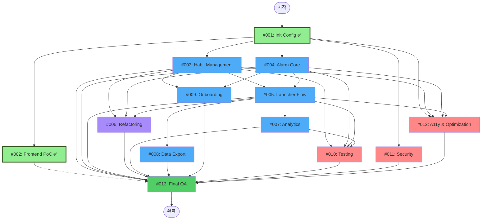

# 이슈 수행 순서 및 병렬 개발 가이드

> **기준 문서:** `6-1.MVP개발-Task추출통합작업계획.md`  
> **목적:** GitHub Issues의 의존관계를 반영한 실행 순서 및 병렬 개발 가능 영역 정의

---

## 📊 전체 이슈 목록

| Issue # | 제목 | Epic | Priority | Type | Status |
|---------|------|------|----------|------|--------|
| #001 | 프로젝트 초기화 및 기본 환경 설정 | EPIC-0 | P0 | Functional | ✅ **COMPLETED** |
| #002 | 프론트엔드 PoC UI 구현 및 성능 최적화 | EPIC-1 | P1 | Functional | ✅ **COMPLETED** |
| #003 | 습관 관리 데이터 및 로직 구현 | EPIC-2 | P0 | Functional |
| #004 | 알람 코어 로직 및 스케줄러 | EPIC-3 | P0 | Functional |
| #005 | 런처 플로우 및 데이터 연동 | EPIC-4 | P0 | Functional |
| #006 | 구조적 리팩토링 및 에러 처리 | Refactoring | P2 | Functional |
| #007 | 통계 및 목표 관리 | EPIC-5 | P1 | Functional |
| #008 | 데이터 내보내기 및 공유 | EPIC-6 | P2 | Functional |
| #009 | 온보딩 및 초기 설정 | EPIC-7 | P2 | Functional |
| #010 | 테스트 코드 작성 및 안정성 확보 | QA & Reliability | P1 | Non-Functional |
| #011 | 비기능 요구사항 및 보안 점검 | Non-Functional | P1 | Non-Functional |
| #012 | 접근성 개선 및 최적화 | Accessibility | P2 | Non-Functional |
| #013 | 최종 QA 및 배포 준비 | Deployment | P0 | Non-Functional |

---

## 🔄 의존관계 그래프 (DAG)

**색상 설명:**
- 🔴 **빨강**: Critical Path (반드시 순차 진행)
- 🟢 **초록 (굵은 테두리)**: 완료된 작업
- 🔵 **파랑**: 기능 개발 작업
- 🟣 **보라**: 리팩토링 작업
- 🟢 **초록**: 최종 단계
- 🟠 **주황**: 비기능 작업 (병렬 가능)

---

## 📅 단계별 실행 계획

### Phase 1: Foundation (Week 1)

**목표:** 프로젝트 기반 구축 및 핵심 기능 개발 시작

#### Step 1.1: 초기 설정 (필수, 순차)
- [x] **#001: Init Config** ✅ **COMPLETED** (별도 프로젝트에서 완료)
  - 모든 작업의 기반이 되므로 최우선 완료 필요

#### Step 1.2: 핵심 기능 개발 시작 (병렬 가능)
- [ ] **#003: Habit Management** (3-4일) - 개발자 A
- [ ] **#004: Alarm Core Logic** (3-4일) - 개발자 B
- [x] **#002: Frontend PoC** ✅ **COMPLETED** (별도 프론트엔드 프로젝트에서 완료)

**병렬 개발 가능:**
- #003과 #004는 완전히 독립적이므로 동시 진행 가능
- #002는 완료되었으므로 백엔드 API 연동 준비 가능 (#005에서 진행)

---

### Phase 2: Core Integration (Week 2)

**목표:** 핵심 기능 통합 및 런처 플로우 구현

#### Step 2.1: 런처 플로우 구현 (의존성 필요)
- [ ] **#005: Launcher Flow Integration** (4-5일)
  - **의존성:** #003, #004 완료 필수
  - #003과 #004가 완료되면 즉시 시작 가능

#### Step 2.2: 병렬 작업 (기능 개발과 함께 진행 가능)
- [ ] **#006: Structural Refactoring** (지속적)
  - 기능 개발 중간에 점진적으로 진행
  - #003, #004, #005 완료 후 본격 시작 권장
  
- [ ] **#010: Testing and Reliability** (지속적)
  - 각 기능 완료 시마다 테스트 작성
  - #003, #004, #005 완료 후 본격 시작

- [ ] **#011: NonFunctional Security** (지속적)
  - 기능 개발과 병렬로 진행 가능
  - 보안 점검은 정기적으로 수행

- [ ] **#012: A11y and Optimization** (지속적)
  - 기능 개발과 병렬로 진행 가능
  - API 응답 형식 개선은 지속적으로 진행

---

### Phase 3: Extended Features (Week 3)

**목표:** 확장 기능 및 비기능 요구사항 완료

#### Step 3.1: 확장 기능 개발 (의존성 필요)
- [ ] **#007: Analytics and Goal** (3-4일)
  - **의존성:** #005 완료 필수 (LogEntry 데이터 필요)
  
- [ ] **#008: Data Export** (2-3일)
  - **의존성:** #005 완료 필수 (LogEntry 데이터 필요)
  
- [ ] **#009: Onboarding Process** (2-3일)
  - **의존성:** #003, #004 완료 필수

**병렬 개발 가능:**
- #007과 #008은 서로 독립적이므로 동시 진행 가능
- #009는 #003, #004 완료 후 시작 가능

#### Step 3.2: 비기능 작업 완료
- [ ] **#006: Structural Refactoring** (완료)
- [ ] **#010: Testing and Reliability** (완료)
- [ ] **#011: NonFunctional Security** (완료)
- [ ] **#012: A11y and Optimization** (완료)

---

### Phase 4: Final QA & Deployment (Week 4)

**목표:** 최종 QA 및 배포 준비

#### Step 4.1: 최종 QA (모든 작업 완료 후)
- [ ] **#013: Final QA and Deployment** (5-7일)
  - **의존성:** 모든 이전 이슈 완료 필수
  - 수동 테스트, 버그 수정, 배포 준비

---

## 🚀 병렬 개발 전략

### 전략 1: 기능별 병렬 개발

**개발자 A (Backend Core):**
- Week 1: #001 → #003
- Week 2: #005 (일부), #007
- Week 3: #007 완료, #009

**개발자 B (Backend Integration):**
- Week 1: #001 → #004
- Week 2: #005 (일부), #008
- Week 3: #008 완료, 리팩토링 지원

**개발자 C (QA & DevOps):**
- Week 1: #011 시작 (Frontend PoC는 별도 프로젝트에서 완료됨)
- Week 2: #010, #011, #012
- Week 3: #010, #011, #012 완료
- Week 4: #013

### 전략 2: 단계별 집중 개발

**Week 1: Foundation**
- 모든 개발자: #001 완료 후
- 개발자 A: #003
- 개발자 B: #004
- 개발자 C: #011 시작 (#002는 별도 프로젝트에서 완료됨)

**Week 2: Integration**
- 개발자 A + B: #005 (협업)
- 개발자 C: #010, #011, #012

**Week 3: Extension**
- 개발자 A: #007
- 개발자 B: #008
- 개발자 A 또는 B: #009
- 개발자 C: #006, #010, #011, #012 완료

**Week 4: QA**
- 모든 개발자: #013

---

## ⚠️ 주의사항

### Critical Path (반드시 순차 진행)
1. **#001** → **#003, #004** → **#005** → **#007, #008** → **#013**

### 완료된 작업
- ✅ **#001: Init Config** - 별도 프로젝트에서 완료됨 (EPIC-0)
- ✅ **#002: Frontend PoC** - 별도 프론트엔드 프로젝트에서 완료됨

### 병렬 개발 시 주의점
- **#003과 #004**: 완전히 독립적이므로 동시 진행 가능
- **#007과 #008**: 서로 독립적이지만 둘 다 #005 완료 필요
- **#006, #010, #011, #012**: 기능 개발과 병렬로 진행 가능하지만, 기능 완료 후 본격 시작 권장
- **#009**: #003, #004 완료 후 시작 가능

### 의존성 체크리스트
- [x] #001: Init Config ✅ (별도 프로젝트에서 완료)
- [x] #002: Frontend PoC ✅ (별도 프로젝트에서 완료)
- [ ] #005 시작 전: #003 ✅, #004 ✅
- [ ] #007 시작 전: #005 ✅
- [ ] #008 시작 전: #005 ✅
- [ ] #009 시작 전: #003 ✅, #004 ✅
- [ ] #013 시작 전: #002 ✅, 나머지 이슈 진행 중

---

## 📈 진행 상황 추적

### 완료 기준
- [ ] 모든 Sub-Task 완료
- [ ] Acceptance Criteria 달성
- [ ] 테스트 통과
- [ ] 코드 리뷰 완료
- [ ] 문서 업데이트 완료

### 진행 상황 업데이트
- 각 이슈의 진행 상황을 주기적으로 업데이트
- 블로커가 발생하면 즉시 팀에 공유
- 의존성 이슈는 사전에 확인

---

## 🔗 관련 문서

- [이슈 목록](github-issues/)
- [Task 추출 결과](Tasks%20copy/6.%20Task%EC%B6%94%EC%B6%9C%EA%B2%B0%EA%B3%BC.md)
- [MVP 개발 Task 추출 통합 작업계획](Digital-minimalist-project_Self-development%20copy/6-1.MVP%EA%B0%9C%EB%B0%9C-Task%EC%B6%94%EC%B6%9C%ED%86%B5%ED%95%A9%EC%9E%91%EC%97%85%EA%B3%84%ED%9A%8D.md)

---

## ✅ 완료된 작업 현황

- **#001: Init Config** ✅ - 별도 프로젝트에서 완료됨 (EPIC-0)
  - 프로젝트 초기화 및 기본 환경 설정이 완료되어 백엔드 개발 기반이 마련됨
  - 이후 모든 작업은 #001의 기반 위에서 진행됨

- **#002: Frontend PoC** ✅ - 별도 프론트엔드 프로젝트에서 완료됨
  - 프론트엔드 UI가 준비되어 있어 백엔드 API 개발 시 실제 연동 테스트 가능
  - #005에서 백엔드 API 구현 후 프론트엔드와 연동 테스트 진행 예정

자세한 내용은 [COMPLETED_ISSUES.md](COMPLETED_ISSUES.md)를 참조하세요.

---

**마지막 업데이트:** 2025-01-15

